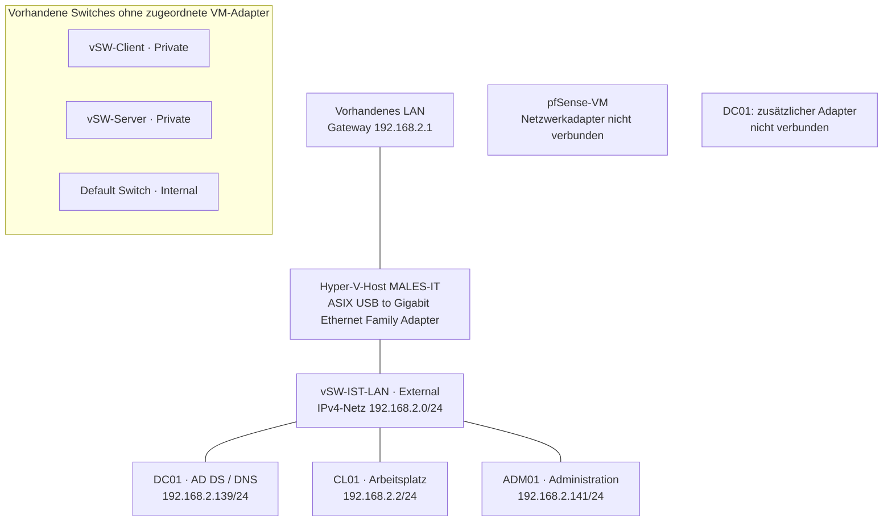
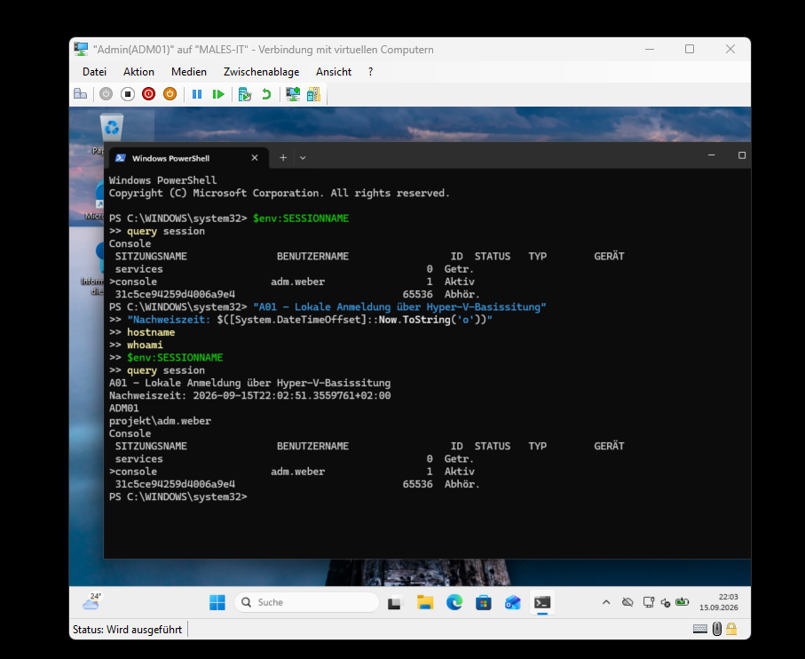
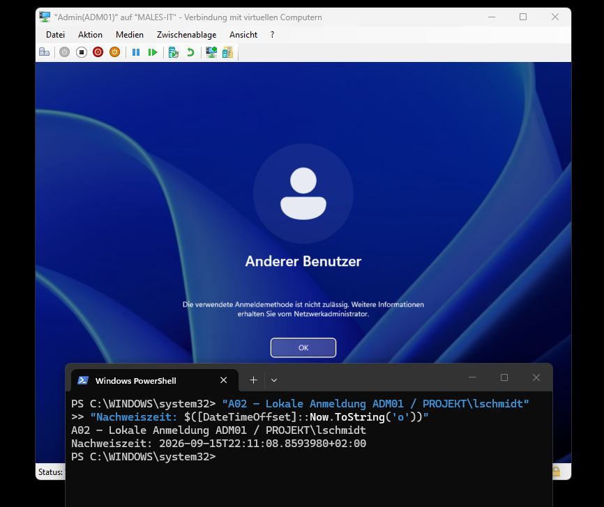
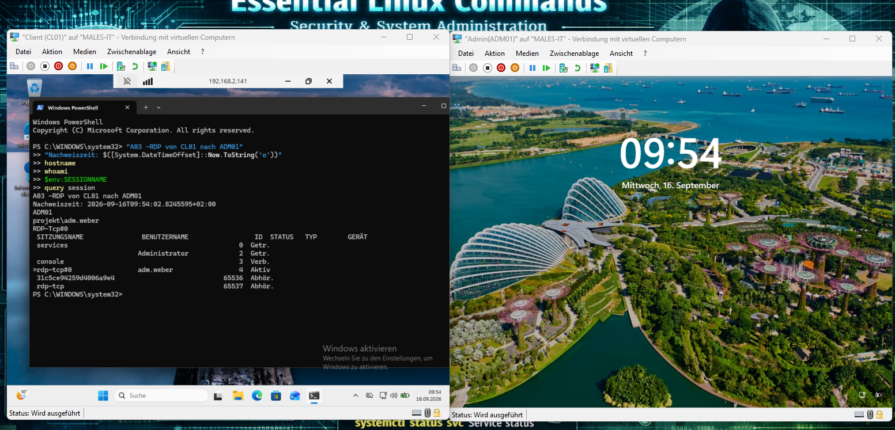
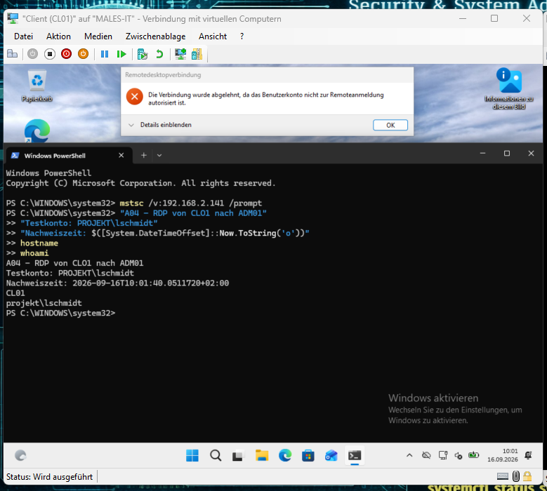

# Dokumentation des IST-Zustandes

## Netzwerkumgebung vor der Segmentierung mit pfSense

| Dokumentangabe | Inhalt |
|---|---|
| Projekt | Risikobasierte Konzeption und Umsetzung einer Netzwerksegmentierung mit pfSense in einer virtualisierten Netzwerkumgebung |
| Verfasser | Marco Males |
| Fassung | Finale konsolidierte IST-Dokumentation |
| Dokumentstand | 16.09.2026 |
| Erhebungszeitraum | 15.–16.09.2026 |
| Status | IST-Aufnahme im dokumentierten Prüfumfang abgeschlossen |
| Zeitangaben | Lokale Rechnerzeiten mit UTC-Offset +02:00; Genauigkeitsgrenzen siehe Kapitel 7 |

## Inhaltsverzeichnis

1. [Ziel und Untersuchungsumfang](#1-ziel-und-untersuchungsumfang)
2. [Erhebungsmethode und Ausgangsbasis](#2-erhebungsmethode-und-ausgangsbasis)
3. [System- und Netzwerkstruktur](#3-system--und-netzwerkstruktur)
4. [Änderungen während der IST-Aufnahme](#4-änderungen-während-der-ist-aufnahme)
5. [DNS- und TCP-Prüfungen](#5-dns--und-tcp-prüfungen)
6. [Anmeldeberechtigungen und Screenshot-Nachweise](#6-anmeldeberechtigungen-und-screenshot-nachweise)
7. [Zeitbasis und Nachweisqualität](#7-zeitbasis-und-nachweisqualität)
8. [Gesamtbewertung und Abgrenzung zum SOLL](#8-gesamtbewertung-und-abgrenzung-zum-soll)
9. [Anhang: Einzelzeiten der TCP-Prüfungen](#9-anhang-einzelzeiten-der-tcp-prüfungen)
10. [Abbildungsverzeichnis](#10-abbildungsverzeichnis)
11. [Quellen- und Nachweisverzeichnis](#11-quellen--und-nachweisverzeichnis)

## 1. Ziel und Untersuchungsumfang

Die IST-Aufnahme beschreibt die vorhandene virtualisierte Netzwerkumgebung vor der technischen Umsetzung der Netzwerksegmentierung. Sie bildet die Referenz für die nachfolgende Schutzbedarfsbetrachtung, Risikoanalyse und SOLL-Konzeption sowie für den späteren Vergleich der Kommunikationsmöglichkeiten.

Untersucht wurden die Systeme DC01, CL01 und ADM01, ihre Netzwerkparameter und die Zuordnung zu den virtuellen Switches des Hyper-V-Hosts. Ergänzend wurden die DNS-Auflösung, ausgewählte TCP-Verbindungen zum Domänencontroller sowie lokale und Remote-Anmeldungen auf ADM01 geprüft. Die pfSense-VM wurde hinsichtlich ihrer Netzwerkanbindung erfasst.

Die endgültige Ausgangsbasis enthält bereits vorbereitende Änderungen: RDP wurde auf DC01 und ADM01 aktiviert, die Domänen-Adminmitgliedschaft von adm.weber entfernt und die Anmeldung auf ADM01 eingeschränkt. Diese Änderungen werden gesondert ausgewiesen. Die Netzwerksegmentierung mit pfSense war im dokumentierten Stand noch nicht umgesetzt.

Die vorliegende Dokumentation löst die in der Ausgangsdatei zusammengeführten drei Entwurfsfassungen inhaltlich ab. Aussagen aus diesen Fassungen wurden nach ihrem Erhebungszeitpunkt eingeordnet und mit den verfügbaren Nachweisen abgeglichen. Nicht unmittelbar durch eine Rohdatei belegte Angaben sind als Befunde der Arbeitsdokumentation gekennzeichnet.[^Q00]

## 2. Erhebungsmethode und Ausgangsbasis

### 2.1 Eingesetzte Verfahren

| Untersuchungsbereich | Verfahren | Aussage |
|---|---|---|
| Windows-Netzwerkkonfiguration | `hostname`, `Get-NetIPConfiguration`, `Get-NetIPAddress`, `Get-DnsClientServerAddress` | Rechneridentität, Adapter, Adressen, Gateway, DNS und Adressvergabe |
| Hyper-V | `Get-VMSwitch`, `Get-VMNetworkAdapter`, `Get-VMNetworkAdapterVlan` | Switchtypen, VM-Zuordnungen und VLAN-Modi |
| DNS | `nslookup` für Host- und AD-SRV-Abfragen | Antwort des abgefragten DNS-Servers |
| TCP | `Test-NetConnection` an 192.168.2.139 | Verbindungsaufbau zu ausgewählten IPv4-TCP-Ports |
| RDP-Diagnose | Dienststatus, Listener auf TCP 3389, `fDenyTSConnections` | Zustand der Remotezugriffsfunktion |
| Benutzeranmeldung | Lokale Basissitzung und RDP, `whoami`, `$env:SESSIONNAME`, `query session` | Konto, Sitzungsart und beobachtete Zulassung beziehungsweise Ablehnung |
| Zeitbasis | `DateTimeOffset`, `w32tm /query /status` | Rechnerzeit und gemeldete Synchronisationsquelle |

Die automatisierten Clienttests liefen unter `PROJEKT\Administrator`. Sie untersuchten die Kommunikation der Rechner und sind kein Berechtigungsnachweis für normale Benutzer. Die gesonderten Anmeldetests verwendeten die Konten `PROJEKT\adm.weber` und `PROJEKT\lschmidt`.[^Q01][^Q03][^Q08][^Q11]

### 2.2 Aussagegrenzen

Ein erfolgreicher TCP-Verbindungsaufbau bestätigt die Erreichbarkeit des Ports, nicht die vollständige Funktion des dahinterliegenden Dienstes. Ein fehlgeschlagener Aufbau belegt ohne Ursachenprüfung keine Firewall-Sperre. Die Untersuchungen umfassen keine vollständige AD-Funktionsprüfung, keine systematische UDP-Prüfung und keine IPv6-Porttests. Ebenso wurde kein vollständiger Export sämtlicher effektiver Anmelderichtlinien erstellt.

## 3. System- und Netzwerkstruktur

### 3.1 Systeme und Rollen

| System | Betriebssystem laut Projektplanung | Aufgabe |
|---|---|---|
| DC01 | Windows Server 2022 | Domänencontroller mit Active Directory Domain Services und DNS |
| CL01 | Windows 11 | Normaler Arbeitsplatzrechner |
| ADM01 | Windows 11 | Administrativer Arbeitsplatz |
| pfSense-VM | pfSense | Vorgesehene Firewall und Routinginstanz; geplanter Rollenname FW01 |

Die Virtualisierung erfolgt auf dem Host **MALES-IT** mit Microsoft Hyper-V. Die Domäne lautet **ad.projekt.test**, der NetBIOS-Domänenname **PROJEKT**. Die konkrete pfSense-Version und eine aktive IP-Konfiguration dieser VM wurden nicht erhoben.[^Q00][^Q06]

### 3.2 IPv4-Konfiguration

| Merkmal | DC01 | CL01 | ADM01 |
|---|---|---|---|
| IPv4-Adresse | 192.168.2.139/24 | 192.168.2.2/24 | 192.168.2.141/24 |
| Subnetzmaske | 255.255.255.0 | 255.255.255.0 | 255.255.255.0 |
| Gateway | 192.168.2.1 | 192.168.2.1 | 192.168.2.1 |
| DNS IPv4 | 127.0.0.1 | 192.168.2.139 | 192.168.2.139 |
| Adressvergabe | DHCP | Manuell | Manuell |
| Aktiver Adapter | Ethernet 2 | Ethernet | Ethernet |
| InterfaceIndex | 5 | 6 | 7 |

Alle drei Rechner befinden sich im Netz **192.168.2.0/24**. DC01 nutzt über die Loopback-Adresse 127.0.0.1 seinen eigenen DNS-Dienst. Zusätzlich besitzt DC01 einen nicht verbundenen Adapter „Ethernet“ mit InterfaceIndex 7.

Die DC01-Parameter stammen aus der ursprünglichen Konsolenerhebung in der Arbeitsdokumentation ohne gesicherten Einzelzeitpunkt. Die Clientparameter wurden in den zeitgestempelten Rohprotokollen bestätigt. Ob für DC01 eine DHCP-Reservierung besteht, wurde nicht nachgewiesen.[^Q00][^Q01][^Q03]

### 3.3 IPv6-Konfiguration und beobachtete Änderungen

IPv6 war auf den drei Windows-Systemen aktiv. Die ursprüngliche Aufnahme enthielt folgende globale Adressen:

| System | Globale IPv6-Adresse der ursprünglichen Aufnahme | IPv6-Gateway | IPv6-DNS |
|---|---|---|---|
| DC01 | `2003:c0:af2e:c315:7079:85cc:6417:e9cd` | `fe80::1` | `::1` |
| CL01 | `2003:c0:af2e:c315:ea64:76c5:7f02:6b3b` | `fe80::1` | `fe80::1` |
| ADM01 | `2003:c0:af2e:c315:664f:8753:5516:8bee` | `fe80::1` | `fe80::1` |

Die Clientprotokolle enthalten zusätzlich Link-Local-Adressen und weitere globale IPv6-Adressen. Die Tabelle stellt daher keine vollständige Adressinventur dar.[^Q00][^Q01][^Q03]

Am 15.09.2026 um 19:41 Uhr lieferte DNS für DC01 zusätzlich `2003:c0:af2e:c3ac:4b:f5c2:337a:4ec1`. Beide globalen IPv6-Adressen wurden gleichzeitig aufgelöst. Bei der ADM01-Diagnose am 16.09.2026 wurde `2003:c0:af2e:c3ac:c03d:9081:aef8:5790` angezeigt. Die Ursache der Änderungen und die Gültigkeit beziehungsweise Erreichbarkeit aller zurückgelieferten Adressen wurden nicht abschließend geprüft.[^Q05][^Q00]

### 3.4 Virtuelle Switches und Adapterzuordnung

Die Hyper-V-Struktur wurde am **15.09.2026 von 17:45:07.7615996 bis 17:45:16.0850071 Uhr (UTC+02:00)** erfasst.[^Q06]

| Switch | Typ | Zuordnung beziehungsweise Anbindung |
|---|---|---|
| vSW-IST-LAN | External | Physischer Adapter „ASIX USB to Gigabit Ethernet Family Adapter“; DC01, CL01 und ADM01 angebunden |
| vSW-Client | Private | Kein VM-Adapter zugeordnet |
| vSW-Server | Private | Kein VM-Adapter zugeordnet |
| Default Switch | Internal | Kein VM-Adapter in der vorliegenden Ausgabe zugeordnet |

DC01 besitzt einen Adapter an vSW-IST-LAN und einen Adapter ohne Switchzuordnung. Die pfSense-VM besitzt einen Adapter ohne Switchzuordnung. Alle fünf erfassten VM-Adapter stehen auf **Untagged**. Ein separater MGMT-Switch ist in der Erhebung nicht vorhanden.[^Q06]

### 3.5 IST-Netzplan



*Abbildung 1: IST-Netzstruktur aus der Windows-Aufnahme und dem Hyper-V-Protokoll. Die getrennt dargestellten Komponenten sind nicht in den Kommunikationsweg der drei Windows-Systeme eingebunden.*[^Q00][^Q01][^Q03][^Q06]

Die Client-, Server- und Administrationsrolle teilen somit dasselbe IPv4-Subnetz und denselben externen Switch. Die bereits angelegten privaten Switches bewirken noch keine Trennung. Windows-Firewalls können einzelne Verbindungen dennoch beschränken; ein gemeinsames Subnetz ist kein Beleg für uneingeschränkte Erreichbarkeit.

## 4. Änderungen während der IST-Aufnahme

Die folgende Übersicht unterscheidet ursprüngliche Befunde von den für die Vergleichstests vorgenommenen Anpassungen. Die genauen Schaltzeitpunkte der RDP- und Kontenänderungen wurden nicht erfasst. Ihre Reihenfolge und Ergebnisse sind in der Arbeitsdokumentation festgehalten.[^Q00]

| Maßnahme | Ursprünglicher Befund | Dokumentierter Stand nach Anpassung |
|---|---|---|
| RDP auf DC01 | TermService lief; kein Listener auf TCP 3389; `fDenyTSConnections=1`; beide Clients meldeten TCP 3389 als nicht erreichbar | RDP aktiviert; TCP 3389 von CL01 und ADM01 erreichbar |
| Berechtigung von adm.weber | Direkte Mitgliedschaft in GG_IT_Admins und Domänen-Admins; RDP-Anmeldung auf DC01 erfolgreich | Mitgliedschaft in Domänen-Admins entfernt; `MemberOf` zeigte anschließend GG_IT_Admins |
| Anmeldebeschränkung ADM01 | Konfiguration während der Aufnahme aufgebaut | Lokale und Remote-Anmeldung für die festgelegten Gruppen eingerichtet und getestet |
| Zeitdienst des Hosts | W32Time gestoppt, Starttyp Manual | Dienst gestartet; erfolgreicher externer Zeitabgleich am 15.09.2026 um 17:48:27 Uhr |
| RDP über LAN auf ADM01 | Am 16.09.2026 zunächst kein Listener auf TCP 3389, `fDenyTSConnections=1`; CL01-Verbindung fehlgeschlagen | RDP aktiviert; anschließend TCP-Verbindung und A03-Anmeldung erfolgreich |

Die Entfernung aus Domänen-Admins wird durch die dokumentierte AD-Abfrage gestützt; `MemberOf` enthält jedoch nicht die primäre Gruppe. Eine aktuelle RDP-Berechtigung von adm.weber auf DC01 wurde nach der Entfernung nicht erneut nachgewiesen.

Die spätere RDP-Aktivierung auf ADM01 war für die LAN-Anmeldetests erforderlich. Eine vorher erfolgreiche erweiterte Hyper-V-Sitzung war dafür kein Erreichbarkeitsnachweis. Keine der aufgeführten Änderungen stellt eine Wirkung der noch nicht umgesetzten pfSense-Segmentierung dar.

## 5. DNS- und TCP-Prüfungen

### 5.1 Testzeiträume

| Erhebung | Beginn | Ende |
|---|---|---|
| CL01 – ursprünglicher protokollierter Lauf | 15.09.2026, 17:33:31.0247364 | 15.09.2026, 17:33:37.7847550 |
| ADM01 – protokollierter Lauf | 15.09.2026, 17:38:10.1314963 | 15.09.2026, 17:38:17.3018091 |
| CL01 – ergänzter DNS-Dateinachweis | 15.09.2026, 19:41:55.5513737 | 15.09.2026, 19:41:56.0341394 |

Alle Zeitangaben verwenden **UTC+02:00**. Die letzte Zeit des ergänzten DNS-Laufs entspricht dem Ende von D03.[^Q01][^Q03][^Q05]

### 5.2 DNS-Verfahren

Auf den Clients wurden folgende Abfragen verwendet:

```powershell
nslookup dc01.ad.projekt.test
nslookup dc01.ad.projekt.test 192.168.2.139
nslookup -type=SRV _ldap._tcp.dc._msdcs.ad.projekt.test 192.168.2.139
```

| Test | Prüfziel | Ergebnis |
|---|---|---|
| D01 | Hostname über den standardmäßig verwendeten DNS-Server | DC01 wurde aufgelöst; verwendeter Server 192.168.2.139 |
| D02 | Hostname explizit über 192.168.2.139 | DC01 wurde aufgelöst |
| D03 | AD-SRV-Eintrag über 192.168.2.139 | Ziel dc01.ad.projekt.test, Port 389, Priorität 0, Gewichtung 100 |

Diese Ergebnisse sind für ADM01 im Rohprotokoll und für CL01 im ergänzten DNS-Dateinachweis enthalten.[^Q03][^Q05]

Die frühen Hostabfragen lieferten die IPv4-Adresse `192.168.2.139` und die IPv6-Adresse `2003:c0:af2e:c315:7079:85cc:6417:e9cd`. Beim späteren CL01-Lauf wurde zusätzlich die in Kapitel 3.3 genannte zweite IPv6-Adresse zurückgegeben. Die Reihenfolge der beiden IPv6-Adressen wechselte zwischen D01 und D02; die Adressmenge war gleich.[^Q03][^Q05]

Im ersten CL01-Rohprotokoll sind Befehle und Zeitgrenzen vorhanden, die nativen DNS-Antworttexte fehlen jedoch. Der erneute direkte Dateiexport schließt den Bedarf an einem eigenständigen DNS-Nachweis durch eine neue Erhebung; die ursprüngliche Datei wurde nicht verändert oder rückdatiert.[^Q01][^Q05]

Als DNS-Servername wurde `DC01adprojekttest.speedport.ip` angezeigt. Diese Abweichung zum AD-Namen ist dokumentiert, ihre Ursache aber nicht abschließend untersucht. Die erfolgreiche SRV-Abfrage belegt die Bereitstellung des entsprechenden DNS-Eintrags, nicht die vollständige Funktionsfähigkeit sämtlicher AD-Dienste.

### 5.3 TCP-Verfahren und Ergebnisse

Die gezielten IPv4-Verbindungen wurden mit folgendem Verfahren geprüft:

```powershell
53,88,389,445,3389 | ForEach-Object {
    Test-NetConnection 192.168.2.139 -Port $_ |
        Select-Object ComputerName, RemoteAddress, RemotePort, TcpTestSucceeded
}
```

| Ziel DC01 | CL01 | ADM01 | Bewertung |
|---|---|---|---|
| TCP 53 – DNS | True | True | TCP-Verbindungsaufbau möglich |
| TCP 88 – Kerberos | True | True | TCP-Verbindungsaufbau möglich |
| TCP 389 – LDAP | True | True | TCP-Verbindungsaufbau möglich |
| TCP 445 – SMB | True | True | TCP-Verbindungsaufbau möglich |
| TCP 3389 – RDP | True | True | Nach Aktivierung von RDP erreichbar |

Die zehn Werte und ihre Einzelzeiten wurden mit beiden archivierten CSV-Dateien abgeglichen; alle Error-Felder sind leer. Die Einzelzeiten stehen in Kapitel 9.[^Q02][^Q04]

Das ursprüngliche negative RDP-Ergebnis beruhte auf deaktiviertem RDP auf DC01. Erst die Ergebnisse nach dessen Aktivierung bilden die vorbereitete Referenz für einen späteren Firewallvergleich. Der RDP-Port ist nun auch vom normalen Clientrechner aus erreichbar. Daraus folgt keine Berechtigung eines normalen Benutzerkontos zur Anmeldung.

## 6. Anmeldeberechtigungen und Screenshot-Nachweise

### 6.1 Dokumentierte Konfiguration auf ADM01

Das Computerobjekt ADM01 wurde in eine eigene Unter-OU verschoben:

```text
ad.projekt.test/Computer/Management/ADM01/ADM01
```

An dieser OU wurde die Richtlinie **ADM01 - Anmeldung beschränken** verknüpft. Laut Arbeitsdokumentation wurden die Rechte „Lokal anmelden zulassen“ und „Anmelden über Remotedesktopdienste zulassen“ auf **VORDEFINIERT\Administratoren** und **PROJEKT\GG_IT_Admins** gesetzt. Zusätzlich wurde GG_IT_Admins auf ADM01 in die lokale Gruppe **Remotedesktopbenutzer** aufgenommen.[^Q00]

Nach bekanntem Stand ist adm.weber Mitglied von GG_IT_Admins. Die konfigurierte Anmeldeberechtigung verleiht ihm allein keine vollständigen Administratorrechte. Bestehende Administratoren bleiben über die integrierte Administratorengruppe berücksichtigt. Da kein vollständiger Richtlinienexport vorliegt, wird die Funktion für die geprüften Konten anhand der folgenden Tests nachgewiesen.

### 6.2 Ergebnisübersicht

| Test | Anmeldeweg | Konto | Erwartung | Ergebnis | Beobachtungszeit, UTC+02:00 |
|---|---|---|---|---|---|
| A01 | Lokal auf ADM01, Hyper-V-Basissitzung | PROJEKT\adm.weber | Erlaubt | Erfolgreich | 15.09.2026, 22:02:51.3559761 |
| A02 | Lokal auf ADM01, gleiche Basissitzung | PROJEKT\lschmidt | Abgewiesen | Abgewiesen | 15.09.2026, 22:11:08.8593980 |
| A03 | RDP von CL01 zu ADM01 / 192.168.2.141 | PROJEKT\adm.weber | Erlaubt | Erfolgreich | 16.09.2026, 09:54:02.8245595 |
| A04 | RDP von CL01 zu ADM01 / 192.168.2.141 | PROJEKT\lschmidt | Abgewiesen | Abgewiesen | 16.09.2026, 10:01:40.0511720 |

Alle vier Fälle entsprechen der Erwartung. Die Zeiten stammen aus den im Screenshot sichtbaren Ausgaben; sie bezeichnen die Nachweiserstellung und nicht den exakten Windows-Anmeldezeitpunkt.[^Q08][^Q09][^Q10][^Q11]

### 6.3 A01 – Lokale Anmeldung von adm.weber

Der Screenshot zeigt `hostname` mit ADM01, `whoami` mit `projekt\adm.weber` und `Console` als Sitzungsname. `query session` markiert `console` als aktuelle aktive Sitzung. Damit ist die lokale Konsolenanmeldung des berechtigten Kontos belegt. Der vollständige Nachweis von 22:02:51 Uhr wird gegenüber dem früheren Screenshot von 19:52:19 Uhr verwendet, weil er zusätzlich die Sitzungsart zeigt.[^Q08][^Q00]



*Abbildung 2: Erfolgreiche lokale Anmeldung auf ADM01, 15.09.2026, 22:02:51 Uhr. Quelle: Q08.*

### 6.4 A02 – Lokale Anmeldung von lschmidt

Die Windows-Meldung lautet: **„Die verwendete Anmeldemethode ist nicht zulässig.“** Das VM-Fenster zeigt ADM01. Die daneben ausgegebene Testbeschriftung ordnet den Versuch `PROJEKT\lschmidt` zu und enthält den Beobachtungszeitpunkt. Der Kontoname ist nicht Bestandteil der Fehlermeldung selbst; seine Zuordnung beruht auf Testbeschriftung und dokumentiertem Ablauf.[^Q09]



*Abbildung 3: Abgewiesener lokaler Anmeldeversuch, 15.09.2026, 22:11:08 Uhr. Quelle: Q09.*

### 6.5 A03 – Remoteanmeldung von adm.weber

Im Hyper-V-Fenster von CL01 ist die RDP-Verbindung zu `192.168.2.141` sichtbar. Innerhalb der Sitzung geben `hostname` und `whoami` ADM01 und `projekt\adm.weber` aus. Der aktuelle Sitzungsname `rdp-tcp#0` mit Status „Aktiv“ bestätigt die Remoteanmeldung.[^Q10]



*Abbildung 4: Erfolgreiche RDP-Anmeldung von CL01 auf ADM01, 16.09.2026, 09:54:02 Uhr. Quelle: Q10.*

### 6.6 A04 – Remoteanmeldung von lschmidt

Die RDP-Meldung lautet: **„Die Verbindung wurde abgelehnt, da das Benutzerkonto nicht zur Remoteanmeldung autorisiert ist.“** Im Screenshot sind der Aufruf `mstsc /v:192.168.2.141 /prompt`, CL01 als Quellrechner, `projekt\lschmidt` als dort angemeldetes Konto sowie Testbeschriftung und Beobachtungszeit sichtbar. Die Zuordnung des im RDP-Dialog verwendeten Kontos beruht ergänzend auf dem dokumentierten Testablauf.[^Q11]



*Abbildung 5: Abgewiesene RDP-Anmeldung von CL01 auf ADM01, 16.09.2026, 10:01:40 Uhr. Quelle: Q11.*

Die Testreihe belegt die gewünschte Trennung für die beiden geprüften Konten und beide Anmeldewege. Sie ist kein Nachweis einer Sperre durch pfSense und keine pauschale Prüfung sämtlicher Domänenkonten.

## 7. Zeitbasis und Nachweisqualität

Die Clientausgaben meldeten **VM IC Time Synchronization Provider** als Zeitquelle. Für ADM01 ist dies im Rohprotokoll enthalten; bei CL01 ist die native Ausgabe nur in der früher übermittelten Konsolenausgabe beziehungsweise Arbeitsdokumentation festgehalten.[^Q03][^Q00]

Während der Hyper-V-Aufnahme um 17:45 Uhr war der Windows-Zeitdienst des Hosts nicht gestartet. `w32tm /query /status` meldete Fehler **0x80070426**. Nach Start des Dienstes wurde die bereits konfigurierte Quelle `time.windows.com,0x9` verwendet. Der gespeicherte Status belegt eine erfolgreiche Synchronisierung am **15.09.2026 um 17:48:27 Uhr**, Stratum **5**, Sprungindikator **0**. Die Statusdatei wurde um **17:48:51.2134629 Uhr** erstellt.[^Q06][^Q07]

Die früheren Testzeiten bleiben lokale Rechnerzeiten mit unbekannter damaliger absoluter Abweichung. Der spätere Abgleich bestätigt sie nicht rückwirkend. Auch die Nachkommastellen sind keine Genauigkeitszusage. Eine erneute Überprüfung jeder VM-Uhr vor jedem Anmeldetest liegt nicht vor.

Die Protokolle besitzen zwei weitere dokumentierte Grenzen: Im ersten CL01-Transcript fehlen die nativen DNS-Antworttexte; hierfür liegt der gesonderte spätere DNS-Nachweis vor. In beiden TCP-CSV-Dateien ist `SourceAddress` als Objekttext serialisiert. Die IPv4-Adressen der Adapter sind separat in den Rohprotokollen erfasst. Die Originaldateien wurden nicht korrigierend überschrieben.[^Q01][^Q02][^Q04][^Q05]

## 8. Gesamtbewertung und Abgrenzung zum SOLL

### 8.1 Zusammenfassung des aufgenommenen Zustandes

Die Umgebung ist auf Netzwerkebene noch nicht nach Client-, Server- und Administrationsrolle segmentiert. Die drei Windows-VMs teilen einen externen Switch und ein IPv4-Subnetz. pfSense ist nach dem Topologienachweis nicht in ihren Kommunikationsweg eingebunden. Die vorhandenen privaten Switches sind bislang ungenutzt.

Die DNS-Abfragen und zehn TCP-Tests liefern eine dokumentierte Ausgangsbasis. Nach Aktivierung von RDP erreicht CL01 den RDP-Port von DC01. Nach zusätzlicher RDP-Aktivierung auf ADM01 sind auch Remoteanmeldeversuche von CL01 auf ADM01 möglich. Die Windows-Kontrollmechanismen erlauben dabei adm.weber die lokale und Remote-Anmeldung, während lschmidt auf beiden Wegen abgewiesen wird. Netzwerk-Erreichbarkeit und Benutzerberechtigung werden somit als unterschiedliche Kontrollebenen erfasst.

### 8.2 Relevante Befunde für die weitere Projektarbeit

| Befund | Folgerung für die weitere Bearbeitung |
|---|---|
| Gemeinsames Netz für unterschiedliche Rollen | Sicherheitszonen und zulässige Kommunikationsbeziehungen definieren |
| RDP-Dienste von CL01 aus erreichbar | Administrative Verbindungswege im SOLL gezielt einschränken |
| Kontobasierte Beschränkung auf ADM01 nachgewiesen | Als bereits vorhandene Maßnahme berücksichtigen |
| DC01 bezieht IPv4 über DHCP | Dauerhafte Adressierung beziehungsweise Reservierung klären |
| IPv6 aktiv, globale Adressen verändern sich | IPv6 ausdrücklich in die Sicherheitskonzeption einbeziehen |
| Abweichender DNS-Servername | DNS- und Reverse-DNS-Konfiguration gesondert bewerten |
| Eingeschränkte historische Zeitgenauigkeit | Zeitstempel mit ihrer dokumentierten Aussagegrenze verwenden |

Die qualitative Bedeutung dieser Befunde ist beschrieben; eine formale Schutzbedarfs- oder Risikoeinstufung wurde hier nicht vorweggenommen. Hierfür sind das betriebliche Szenario und die möglichen Schadensauswirkungen noch zu konkretisieren.

### 8.3 Noch nicht umgesetzte SOLL-Entscheidung

Für das SOLL wurde **„IPv6: Deny All“** als Anforderung festgelegt. Geplant ist eine ausschließlich über IPv4 betriebene Projektkommunikation mit Sperre des IPv6-Netzwerkverkehrs an pfSense und auf den Windows-Systemen; interne Loopback-Kommunikation bleibt bestehen. Die konkrete Umsetzung und Prüfung gehören zur folgenden SOLL- und Implementierungsphase.[^Q00]

Diese Planungsentscheidung ändert den IST-Befund nicht: IPv6 ist zum dokumentierten Zeitpunkt aktiv. Ebenso sind die CLIENT-, SERVER- und MGMT-Netze noch nicht technisch getrennt. Der erfolgreiche IST-Test von CL01 zu ADM01 begründet keine Vorgabe, diesen Verbindungsweg im SOLL offenzuhalten.

### 8.4 Abschluss der IST-Aufnahme

Die vereinbarte IST-Aufnahme einschließlich der letzten Anmeldetestreihe ist abgeschlossen. Systeminventar, Topologie, ausgewählte Kommunikationsbeziehungen und beobachtete Anmeldeberechtigungen sind dokumentiert. Die Aussagegrenzen bleiben Bestandteil des Ergebnisses; es wird keine vollständige Sicherheitsprüfung behauptet.

Die Dokumentation dient als Referenz für die nachfolgende Schutzbedarfsbetrachtung, Risikoanalyse und SOLL-Konzeption. Ein späterer Neuaufbau oder eine Wiederholung ist mit neuen Zeitstempeln zu dokumentieren und ersetzt die hier aufgezeichneten historischen Befunde nicht rückwirkend.

## 9. Anhang: Einzelzeiten der TCP-Prüfungen

Datum: **15.09.2026**, Zeitzone: **UTC+02:00**. Ziel aller Verbindungen: **192.168.2.139**. Die Intervalle beschreiben die Prüfaufrufe und sind keine reinen Netzwerklatenzmessungen. Quelle: unveränderte CSV-Dateien.[^Q02][^Q04]

| Quelle | TCP-Port | Start | Ende | Ergebnis |
|---|---|---|---|---|
| CL01 | 53 | 17:33:34.2121808 | 17:33:35.7696951 | True |
| CL01 | 88 | 17:33:35.7743453 | 17:33:36.2975788 | True |
| CL01 | 389 | 17:33:36.2975788 | 17:33:36.8077573 | True |
| CL01 | 445 | 17:33:36.8077573 | 17:33:37.2765280 | True |
| CL01 | 3389 | 17:33:37.2765280 | 17:33:37.7468689 | True |
| ADM01 | 53 | 17:38:13.4489201 | 17:38:15.0878931 | True |
| ADM01 | 88 | 17:38:15.0919022 | 17:38:15.6190760 | True |
| ADM01 | 389 | 17:38:15.6190760 | 17:38:16.1390989 | True |
| ADM01 | 445 | 17:38:16.1390989 | 17:38:16.6970714 | True |
| ADM01 | 3389 | 17:38:16.6970714 | 17:38:17.2299356 | True |

## 10. Abbildungsverzeichnis

| Abbildung | Bezeichnung | Herkunft |
|---|---|---|
| 1 | IST-Netzstruktur | Eigene Darstellung aus Q00, Q01, Q03 und Q06 |
| 2 | A01 – Lokale Anmeldung adm.weber erlaubt | Screenshot Q08 |
| 3 | A02 – Lokale Anmeldung lschmidt abgewiesen | Screenshot Q09 |
| 4 | A03 – Remoteanmeldung adm.weber erlaubt | Screenshot Q10 |
| 5 | A04 – Remoteanmeldung lschmidt abgewiesen | Screenshot Q11 |

## 11. Quellen- und Nachweisverzeichnis

Alle Quellen sind eigene Projektunterlagen von Marco Males aus dem Erhebungszeitraum 15.–16.09.2026. Für diesen dokumentierenden Bericht wurden keine externen Fachquellen ergänzt. Die Protokolle, CSV-Dateien und Screenshots sind Primärnachweise; Q00 ist die redaktionelle Ausgangsdokumentation für Befunde, deren ursprüngliche Konsolenausgaben nicht als eigenständige Datei vorliegen.

Die verlinkten Kopien im Unterordner **IST-Nachweise** entsprechen bytegleich den vorgefundenen Dateien. Die Screenshots wurden weder beschnitten noch inhaltlich bearbeitet. Bei Weitergabe gehören die Markdown-Datei und dieser Unterordner zusammen. Die grafische Netzstruktur verwendet Mermaid, das Obsidian unterstützt.

[^Q00]: **Q00 – Zusammengeführte Entwurfsstände.** [Archivierte Ausgangsdatei](IST-Nachweise/Q00-Entwurfsstaende.md). Original: `02 Projektdurchführung/02 IST-Analyse.md`, enthält die drei gelieferten Fassungen. Verwendet für Systemrollen, ursprüngliche DC01-Konfiguration, Konten- und RDP-Änderungen sowie die SOLL-Planungsentscheidung. Historische Fehlstände und doppelte Inhalte werden durch die Endfassung aufgelöst; die Archivkopie ist keine konkurrierende Endfassung.

[^Q01]: **Q01 – CL01-Rohprotokoll.** [Datei öffnen](IST-Nachweise/Q01-CL01-Rohprotokoll.txt). Original: `10 Nachweise/IST-CL01-20260915-173330/Rohprotokoll.txt`. Erhebung am 15.09.2026, 17:33:31–17:33:37 Uhr. Belegt Laufzeiten und Netzwerkparameter; DNS-Antworttexte und native Zeitdienst-Ausgabe fehlen in dieser Datei.

[^Q02]: **Q02 – CL01-TCP-Ergebnisse.** [CSV öffnen](IST-Nachweise/Q02-CL01-TCP.csv). Original: `10 Nachweise/IST-CL01-20260915-173330/TCP-Ergebnisse.csv`. Fünf TCP-Ergebnisse vom 15.09.2026 mit Start- und Endzeiten, Ziel und Port; Einschränkung des Feldes SourceAddress siehe Kapitel 7.

[^Q03]: **Q03 – ADM01-Rohprotokoll.** [Datei öffnen](IST-Nachweise/Q03-ADM01-Rohprotokoll.txt). Original: `10 Nachweise/IST-ADM01-20260915-173809/Rohprotokoll.txt`. Erhebung am 15.09.2026, 17:38:10–17:38:17 Uhr. Netzwerkparameter, DNS-Antworten, Zeitdienststatus und Laufzeiten.

[^Q04]: **Q04 – ADM01-TCP-Ergebnisse.** [CSV öffnen](IST-Nachweise/Q04-ADM01-TCP.csv). Original: `10 Nachweise/IST-ADM01-20260915-173809/TCP-Ergebnisse.csv`. Fünf TCP-Ergebnisse vom 15.09.2026 mit Start- und Endzeiten; Einschränkung des Feldes SourceAddress siehe Kapitel 7.

[^Q05]: **Q05 – Ergänzter CL01-DNS-Nachweis.** [Datei öffnen](IST-Nachweise/Q05-CL01-DNS.txt). Original: `10 Nachweise/IST-CL01-DNS-20260915-194153.txt`. Neue Erhebung am 15.09.2026, 19:41:55–19:41:56 Uhr, mit vollständigen DNS-Antworten für D01–D03.

[^Q06]: **Q06 – Hyper-V-Topologie.** [Datei öffnen](IST-Nachweise/Q06-HyperV.txt). Original: `10 Nachweise/IST-HyperV-20260915-174507.txt`. Erhebung am 15.09.2026, 17:45:07–17:45:16 Uhr. Switches, Adapterzuordnungen, VLAN-Modi und fehlgeschlagene Zeitstatusabfrage.

[^Q07]: **Q07 – Host-Zeitabgleich.** [Datei öffnen](IST-Nachweise/Q07-Zeitabgleich.txt). Original: `10 Nachweise/IST-Zeitabgleich-20260915.txt`. Gespeichert am 15.09.2026 um 17:48:51 Uhr; meldet erfolgreichen Abgleich um 17:48:27 Uhr mit time.windows.com.

[^Q08]: **Q08 – Screenshot A01.** [Bild öffnen](IST-Nachweise/A01-Lokale-Anmeldung-adm.weber.png). Original: `A01 - Lokale Anmeldung adm.weber.png`. Beobachtungszeit 15.09.2026, 22:02:51.3559761 Uhr; ADM01, adm.weber und aktive Konsolensitzung sichtbar.

[^Q09]: **Q09 – Screenshot A02.** [Bild öffnen](IST-Nachweise/A02-Lokale-Anmeldung-lschmidt.png). Original: `A02 - Lokale Anmeldung lschmidt.png`. Beobachtungszeit 15.09.2026, 22:11:08.8593980 Uhr; lokale Ablehnung und Testzuordnung lschmidt sichtbar. Maßgeblich ist der Bildinhalt; die abweichende ältere Beschriftung in der Sammelnotiz Login.md wurde nicht übernommen.

[^Q10]: **Q10 – Screenshot A03.** [Bild öffnen](IST-Nachweise/A03-RDP-adm.weber.png). Original: `A03 - RDP CL01 -ADM01 adm.weber.png`. Beobachtungszeit 16.09.2026, 09:54:02.8245595 Uhr; Quelle CL01, Ziel ADM01, Konto adm.weber und aktive RDP-Sitzung sichtbar.

[^Q11]: **Q11 – Screenshot A04.** [Bild öffnen](IST-Nachweise/A04-RDP-lschmidt.png). Original: `A04 - RDP CL01 - ADM01 lschmidt.png`. Beobachtungszeit 16.09.2026, 10:01:40.0511720 Uhr; CL01, Zielaufruf und Ablehnung der Remoteanmeldung dokumentiert.
