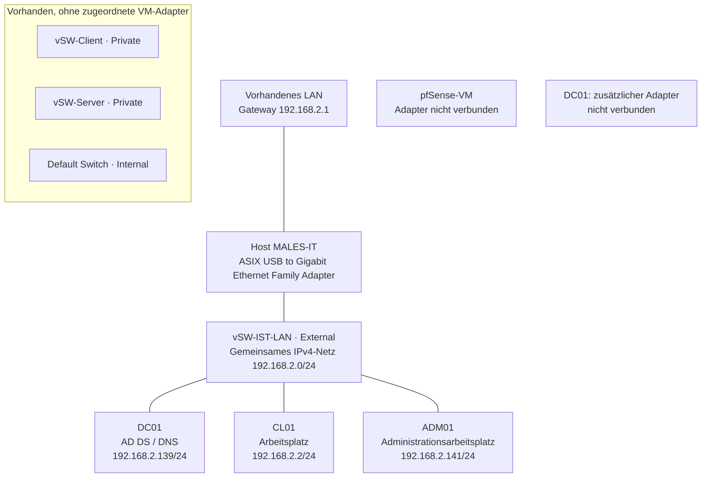

# Version 1.0

## 1. Ziel der IST-Aufnahme

Die IST-Aufnahme dokumentiert die vorhandene virtualisierte Netzwerkumgebung vor der Umsetzung der Netzwerksegmentierung mit pfSense.

Erfasst wurden:

- Systeme und Netzwerkparameter
    
- Hyper-V-Switches und deren Zuordnung
    
- DNS-Auflösung und AD-Diensteinträge
    
- TCP-Erreichbarkeit ausgewählter Dienste
    
- Einrichtung und Prüfung der Anmeldebeschränkung auf ADM01
    
- Änderungen während der Vorbereitung der Vergleichstests
    

Die Ergebnisse dienen als Ausgangsbasis für den späteren Vorher-/Nachher-Vergleich.

> **Dokumentationsstatus:** Die Angaben beruhen auf den ausgeführten Befehlen, übermittelten Ausgaben und Screenshots. Genaue Testzeitpunkte wurden nicht durchgehend erfasst. Die technische Umsetzung der Netzwerksegmentierung steht noch aus.

## 2. Systeme und Rollen

| Rechner    | Betriebssystem laut Projektplanung | Rolle                                                                       |
| ---------- | ---------------------------------- | --------------------------------------------------------------------------- |
| DC01       | Windows Server 2022                | Domänencontroller, AD DS und DNS                                            |
| CL01       | Windows 11                         | Normaler Arbeitsplatzrechner                                                |
| ADM01      | Windows 11                         | Administrativer Arbeitsplatz                                                |
| pfSense-VM | pfSense                            | Vorgesehene zentrale Firewall und Routinginstanz; geplanter Rollenname FW01 |

**AD-Domäne:** `ad.projekt.test`  
**NetBIOS-Domänenname:** `PROJEKT`  
**Virtualisierung:** Microsoft Hyper-V

Die tatsächlich verwendete Bezeichnung des administrativen Rechners lautet **ADM01**.

## 3. Virtuelle Netzwerkstruktur

### 3.1 Vorhandene Switches

| Switch         | Typ      | Anbindung / Verwendung                                            |
| -------------- | -------- | ----------------------------------------------------------------- |
| vSW-IST-LAN    | External | ASIX USB to Gigabit Ethernet Family Adapter; gemeinsames IST-Netz |
| vSW-Client     | Private  | Vorbereitet, aktuell ohne zugeordneten VM-Adapter                 |
| vSW-Server     | Private  | Vorbereitet, aktuell ohne zugeordneten VM-Adapter                 |
| Default Switch | Internal | Keine Zuordnung in der vorliegenden VM-Adapterausgabe             |

Ein eigener MGMT-Switch war in der erfassten Ausgabe nicht vorhanden.

### 3.2 Zuordnung der VM-Netzwerkadapter

| VM            | Netzwerkadapter      | Switch          |
| ------------- | -------------------- | --------------- |
| Client (CL01) | Netzwerkkarte        | vSW-IST-LAN     |
| Admin(ADM01)  | Netzwerkkarte        | vSW-IST-LAN     |
| Server(DC01)  | Ein Adapter          | vSW-IST-LAN     |
| Server(DC01)  | Zusätzlicher Adapter | Nicht verbunden |
| pfsense       | Netzwerkkarte        | Nicht verbunden |

Alle erfassten VM-Netzwerkadapter befinden sich im Modus **Untagged**. Es wurde keine VLAN-Zuordnung festgestellt.

### 3.3 Vereinfachte Darstellung

```
Vorhandenes LAN
Gateway: 192.168.2.1
        |
Physischer Netzwerkadapter des Hyper-V-Hosts
        |
vSW-IST-LAN – externer Switch
        |
        +-- DC01   192.168.2.139/24
        +-- CL01   192.168.2.2/24
        +-- ADM01  192.168.2.141/24

Weitere vorhandene Komponenten:
- vSW-Client: noch ohne VM-Anbindung
- vSW-Server: noch ohne VM-Anbindung
- pfSense-VM: Netzwerkadapter nicht verbunden
```

**Bewertung:** Die drei Windows-Systeme befinden sich im selben IPv4-Subnetz und am selben virtuellen Switch. Eine Trennung ihrer Systemrollen durch separate Netzwerksegmente ist noch nicht umgesetzt. pfSense ist nicht in ihren Kommunikationsweg eingebunden.

## 4. Netzwerkparameter

### 4.1 IPv4

| Merkmal         | DC01          | CL01          | ADM01         |
| --------------- | ------------- | ------------- | ------------- |
| Aktiver Adapter | Ethernet 2    | Ethernet      | Ethernet      |
| InterfaceIndex  | 5             | 6             | 7             |
| IPv4-Adresse    | 192.168.2.139 | 192.168.2.2   | 192.168.2.141 |
| Präfix          | /24           | /24           | /24           |
| Subnetzmaske    | 255.255.255.0 | 255.255.255.0 | 255.255.255.0 |
| Gateway         | 192.168.2.1   | 192.168.2.1   | 192.168.2.1   |
| IPv4-DNS        | 127.0.0.1     | 192.168.2.139 | 192.168.2.139 |
| Adressvergabe   | DHCP          | Manuell       | Manuell       |

DC01 verwendet mit `127.0.0.1` den eigenen DNS-Dienst. Der zusätzliche Adapter **Ethernet**, InterfaceIndex 7, wurde auf DC01 als nicht verbunden angezeigt.

**Auffälligkeit:** DC01 bezieht seine IPv4-Adresse über DHCP. Ob eine DHCP-Reservierung besteht, wurde noch nicht geprüft. Die dauerhafte Adressierung des Domänencontrollers ist im SOLL-Konzept festzulegen.

### 4.2 IPv6

| System | Erfasste IPv6-Adresse                 | IPv6-Gateway | IPv6-DNS |
| ------ | ------------------------------------- | ------------ | -------- |
| DC01   | 2003:c0:af2e:c315:7079:85cc:6417      | fe80::1      | ::1      |
| CL01   | 2003:c0:af2e:c315:ea64:76c5:7f02:6b3b | fe80::1      | fe80::1  |
| ADM01  | 2003:c0:af2e:c315:664f:8753:5516:8bee | fe80::1      | fe80::1  |

**Bewertung:** IPv6 ist aktiv. Die gezielten TCP-Porttests erfolgten ausschließlich über IPv4. Eine eigenständige Prüfung der IPv6-Kommunikation steht noch aus.

Das SOLL-Konzept muss IPv6 ausdrücklich berücksichtigen, damit die spätere Zugriffskontrolle beide verwendeten IP-Protokolle abdeckt.

## 5. Durchgeführte Bestandsaufnahme

Auf den Windows-VMs wurden folgende Befehle verwendet:

```
hostname
Get-NetIPConfiguration
Get-NetIPAddress -AddressFamily IPv4 |
    Select-Object InterfaceAlias, IPAddress, PrefixLength, PrefixOrigin
Get-DnsClientServerAddress -AddressFamily IPv4
```

Auf dem Hyper-V-Host:

```
Get-VMSwitch |
    Select-Object Name, SwitchType, NetAdapterInterfaceDescription

Get-VMNetworkAdapter -VMName * |
    Select-Object VMName, Name, SwitchName, Status

Get-VMNetworkAdapterVlan -VMName *
```

## 6. DNS-Funktionstests

### 6.1 Verfahren

Auf CL01 und ADM01:

```
nslookup dc01.ad.projekt.test
nslookup -type=SRV _ldap._tcp.dc._msdcs.ad.projekt.test 192.168.2.139
```

Zusätzlich auf CL01:

```
nslookup dc01.ad.projekt.test 192.168.2.139
```

### 6.2 Ergebnisse

| Prüfung                                                                | CL01        | ADM01                      |
| ---------------------------------------------------------------------- | ----------- | -------------------------- |
| Namensauflösung von DC01 über den standardmäßig verwendeten DNS-Server | Erfolgreich | Erfolgreich                |
| Explizite Hostabfrage an 192.168.2.139                                 | Erfolgreich | Nicht separat durchgeführt |
| AD-SRV-Abfrage an 192.168.2.139                                        | Erfolgreich | Erfolgreich                |

Die Hostabfragen lieferten:

- IPv4: `192.168.2.139`
    
- IPv6: `2003:c0:af2e:c315:7079:85cc:6417:e9cd`
    

Die SRV-Abfragen lieferten:

- Ziel: `dc01.ad.projekt.test`
    
- Port: `389`
    
- Priorität: `0`
    
- Gewichtung: `100`
    

Bei den erfassten Standardabfragen wurde `192.168.2.139` als DNS-Server verwendet.

### 6.3 Auswertung

Die Namensauflösung für DC01 und der DNS-Eintrag zur Domänencontrollersuche sind von beiden Clients abrufbar.

Als Servername wurde in `nslookup` allerdings `DC01adprojekttest.speedport.ip` angezeigt. Diese abweichende Bezeichnung wird als Auffälligkeit festgehalten; ihre Ursache wurde noch nicht geprüft.

Die DNS-Ergebnisse belegen nicht allein die vollständige Funktion aller AD-Dienste.

## 7. TCP-Erreichbarkeit zu DC01

### 7.1 Verfahren

Auf CL01 und ADM01:

```
53,88,389,445,3389 | ForEach-Object {
    Test-NetConnection 192.168.2.139 -Port $_ |
        Select-Object ComputerName, RemoteAddress, RemotePort, TcpTestSucceeded
}
```

### 7.2 Ursprüngliche Ergebnisse

| Zielport auf DC01 | Dienstzuordnung | CL01  | ADM01 |
| ----------------- | --------------- | ----- | ----- |
| TCP 53            | DNS             | True  | True  |
| TCP 88            | Kerberos        | True  | True  |
| TCP 389           | LDAP            | True  | True  |
| TCP 445           | SMB             | True  | True  |
| TCP 3389          | RDP             | False | False |

**Auswertung:** TCP-Verbindungen zu den ersten vier Ports konnten aufgebaut werden. Dies ist ein Erreichbarkeitsnachweis, kein vollständiger Funktionstest der jeweiligen Dienste. UDP wurde mit diesem Verfahren nicht geprüft.

### 7.3 Untersuchung des RDP-Fehlers

Auf DC01:

```
Get-Service TermService
Get-NetTCPConnection -State Listen -LocalPort 3389 -ErrorAction SilentlyContinue
Get-ItemPropertyValue -Path 'HKLM:\SYSTEM\CurrentControlSet\Control\Terminal Server' -Name fDenyTSConnections
```

Ergebnis:

- Remotedesktopdienste: `Running`
    
- Kein Listener auf TCP 3389
    
- `fDenyTSConnections`: `1`
    

**Bewertung:** RDP war auf DC01 deaktiviert. Das ursprüngliche negative Testergebnis ist kein Nachweis einer Sperre durch Netzwerksegmentierung.

### 7.4 Änderung zur Vorbereitung des Vergleichstests

RDP wurde anschließend auf DC01 aktiviert. Danach wurde von beiden Clients erneut getestet:

```
Test-NetConnection 192.168.2.139 -Port 3389 |
    Select-Object ComputerName, RemoteAddress, RemotePort, TcpTestSucceeded
```

| Verbindung             | Ergebnis nach RDP-Aktivierung |
| ---------------------- | ----------------------------- |
| CL01 → DC01, TCP 3389  | True                          |
| ADM01 → DC01, TCP 3389 | True                          |

Dieser Stand bildet die vorbereitete IPv4-Referenz für den späteren Vergleich:

- **SOLL:** CL01 → DC01, TCP 3389 blockieren
    
- **SOLL:** ADM01 → DC01, TCP 3389 erlauben
    

Die RDP-Aktivierung ist eine Änderung gegenüber dem ursprünglichen IST-Zustand und wird getrennt dokumentiert.

## 8. Konten und Anmeldebeschränkung auf ADM01

### 8.1 Organisatorische Zuordnung

Das Computerobjekt ADM01 wurde in eine eigene Unter-OU verschoben:

```
ad.projekt.test/Computer/Management/ADM01/ADM01
```

Dabei bezeichnet der erste Eintrag `ADM01` die OU und der zweite das Computerobjekt.

Für diese OU wurde die Gruppenrichtlinie **ADM01 - Anmeldung beschränken** erstellt und verknüpft.

### 8.2 Festgestellte Berechtigungen von adm.weber

Eine RDP-Anmeldung von ADM01 auf DC01 war mit `PROJEKT\adm.weber` erfolgreich.

Die anschließende Prüfung zeigte direkte Mitgliedschaften in:

- `GG_IT_Admins`
    
- `Domänen-Admins`
    

Die Gruppe `GG_IT_Admins` hatte laut `MemberOf`-Abfrage selbst keine übergeordneten Gruppenmitgliedschaften.

**Auswertung:** Die erfolgreiche RDP-Anmeldung auf DC01 erfolgte zu diesem Zeitpunkt mit einem Konto mit Domänen-Adminmitgliedschaft. Sie belegt keinen Zugriff eines eingeschränkt berechtigten Administrationskontos.

### 8.3 Bereinigung

Die direkte Mitgliedschaft von `adm.weber` in `Domänen-Admins` wurde entfernt:

```
Remove-ADGroupMember -Identity 'Domänen-Admins' -Members 'adm.weber'
```

Die anschließende Kontrolle zeigte in `MemberOf` nur noch:

```
CN=GG_IT_Admins,OU=Gruppen,DC=ad,DC=projekt,DC=test
```

`MemberOf` listet die primäre Gruppe nicht mit auf. Die Ausgabe ist daher keine vollständige Liste sämtlicher wirksamer Gruppen.

### 8.4 Anmeldekonfiguration

Für ADM01 wurden folgende Gruppen unter den Anmelderechten vorgesehen:

| Benutzerrecht                               | Gruppen                                            |
| ------------------------------------------- | -------------------------------------------------- |
| Lokal anmelden zulassen                     | VORDEFINIERT\Administratoren; PROJEKT\GG_IT_Admins |
| Anmelden über Remotedesktopdienste zulassen | VORDEFINIERT\Administratoren; PROJEKT\GG_IT_Admins |

Beim Speichern der lokalen Anmelderegel traten zunächst Probleme auf. Nach Ergänzung der integrierten Administratorengruppe wurde mit der Konfiguration fortgefahren.

Die weitere Anmeldefehlermeldung bezog sich ausdrücklich auf die Remoteanmeldung. Deshalb wurde zusätzlich die Mitgliedschaft von `GG_IT_Admins` in der lokalen Gruppe **Remotedesktopbenutzer** auf ADM01 eingerichtet und die Gruppenrichtlinie aktualisiert:

```
Add-LocalGroupMember -SID 'S-1-5-32-555' -Member 'PROJEKT\GG_IT_Admins'
gpupdate /force
```

Die Gruppe **Remotedesktopbenutzer** erteilt keine lokalen Administratorrechte.

### 8.5 Funktionale Prüfung

| Konto             | Ziel  | Ergebnis                                 |
| ----------------- | ----- | ---------------------------------------- |
| PROJEKT\adm.weber | ADM01 | Anmeldung nach der Anpassung erfolgreich |
| PROJEKT\lschmidt  | ADM01 | Anmeldung abgewiesen                     |

Die Meldung für `lschmidt` lautete:

> Die verwendete Anmeldemethode ist nicht zulässig.

**Bewertung:** Die Zugriffsbeschränkung ist für den getesteten Anmeldeweg und die beiden geprüften Konten funktional nachgewiesen.

Eine getrennte Prüfung von lokaler Basiskonsolenanmeldung und Remoteanmeldung sowie ein vollständiger Nachweis der effektiv angewendeten Richtlinien stehen noch aus.

Die Maßnahme betrifft Windows-Anmeldeberechtigungen und ist unabhängig von der späteren pfSense-Netzwerksegmentierung.

## 9. Gesamtbewertung des IST-Zustandes

### Nachgewiesen

- DC01, CL01 und ADM01 befinden sich gemeinsam am externen Switch `vSW-IST-LAN`.
    
- Alle drei Systeme verwenden das IPv4-Netz `192.168.2.0/24`.
    
- Es bestehen keine VLAN-Zuordnungen an den erfassten VM-Adaptern.
    
- pfSense ist noch nicht in den Kommunikationsweg eingebunden.
    
- DNS-Auflösung und AD-SRV-Abfragen funktionieren von CL01 und ADM01.
    
- Ausgewählte TCP-Ports auf DC01 sind von beiden Clients erreichbar.
    
- Nach Aktivierung von RDP erreichen auch beide Clients TCP 3389.
    
- Die Domänen-Adminmitgliedschaft von `adm.weber` wurde entfernt.
    
- Der getestete Zugang zu ADM01 funktioniert für `adm.weber` und wird für `lschmidt` abgewiesen.
    

### Sicherheitsbezogene Einordnung

Die Rollen Client, Server und Administration sind noch nicht netzwerkseitig getrennt. Insbesondere kann CL01 nach der RDP-Aktivierung den RDP-Dienst von DC01 erreichen. Eine erfolgreiche Anmeldung ist damit jedoch nicht automatisch möglich; sie hängt zusätzlich von den Kontoberechtigungen ab.

Die bisherigen Tests rechtfertigen nicht die Aussage, dass sämtliche Verbindungen im Netz erlaubt seien. Untersucht wurden ausgewählte Dienste und Kommunikationsrichtungen.

## 10. Offene Punkte und nächste Schritte

- IST-Netzplan und Testnachweise mit genauen Zeitangaben vervollständigen.
    
- Effektiv angewendete Anmelderichtlinien auf ADM01 dokumentieren.
    
- Lokale Anmeldung und Remoteanmeldung auf ADM01 getrennt prüfen.
    
- Tatsächliche Verwaltungsaufgaben und minimale Rechte für adm.weber festlegen.
    
- RDP-Berechtigung auf DC01 nach Entfernung der Domänen-Adminmitgliedschaft klären.
    
- DHCP-Reservierung beziehungsweise dauerhafte Adressierung von DC01 klären.
    
- Abweichende DNS-Serverbezeichnung untersuchen.
    
- IPv6 in das SOLL-Konzept und die Testmatrix aufnehmen.
    
- Schutzbedarf und Risiken der Systeme bewerten.
    
- CLIENT-, SERVER- und MGMT-Netze sowie IP-Adressierung planen.
    
- Kommunikations- und Firewall-Regelmatrix erstellen.
    
- Weitere Funktionstests für AD und benötigte UDP-Kommunikation definieren.
    
- pfSense und die Segmentierung umsetzen.
    
- Vergleichstests mit identischen Testbedingungen durchführen.
    
- Blockierte Verbindungen anhand von pfSense-Logs und ergänzenden Prüfungen zuordnen.
    

> **Wichtig für die Abschlussbewertung:** Ein fehlgeschlagener Verbindungstest allein belegt keine wirksame Firewallregel. Dienstzustand, Windows-Firewall, Zieladresse, IP-Version und pfSense-Logs müssen bei der Bewertung berücksichtigt werden.


# IST-Analyse – Version 1.1

**Projekt:** Risikobasierte Konzeption und Umsetzung einer Netzwerksegmentierung mit pfSense in einer virtualisierten Netzwerkumgebung  
**Verfasser:** Marco Males  
**Erhebungsstand:** 15.09.2026, einschließlich des um 17:48:51 Uhr gespeicherten Zeitstatus  
**Status:** Vorbereitete Testumgebung vor der Netzwerksegmentierung  
**Zeitzone der Messungen:** UTC+02:00

## 1. Zweck und Abgrenzung

Diese Version konsolidiert die IST-Aufnahme, die dokumentierten Änderungen an RDP und Kontoberechtigungen, die wiederholten DNS-/TCP-Tests und den Zeitabgleich des Hyper-V-Hosts. Sie ergänzt die ursprüngliche [[02 IST-Analyse]] durch überprüfte Dateien im Ordner **10 Nachweise**.

Der dokumentierte Stand ist bereits für Vergleichstests vorbereitet: RDP auf DC01 wurde aktiviert und die Anmeldung auf ADM01 eingeschränkt. Die eigentliche Netzwerksegmentierung durch pfSense ist noch nicht umgesetzt. Ursprüngliche Befunde werden deshalb von diesem vorbereiteten Zustand getrennt.

Ein betrieblicher Anwendungskontext und konkrete Schadensauswirkungen sind noch festzulegen. Diese IST-Analyse vergibt keine vorweggenommenen Schutzbedarfs- oder Risikoklassen.

## 2. Systeme und Netzwerkparameter

**Hyper-V-Host:** MALES-IT  
**AD-Domäne:** ad.projekt.test  
**NetBIOS-Name:** PROJEKT

| System     | Rolle                                           | Betriebssystem laut Planung | IPv4             | Vergabe       | Gateway       | DNS IPv4      |
| ---------- | ----------------------------------------------- | --------------------------- | ---------------- | ------------- | ------------- | ------------- |
| DC01       | AD DS und DNS                                   | Windows Server 2022         | 192.168.2.139/24 | DHCP          | 192.168.2.1   | 127.0.0.1     |
| CL01       | Normaler Arbeitsplatz                           | Windows 11                  | 192.168.2.2/24   | Manuell       | 192.168.2.1   | 192.168.2.139 |
| ADM01      | Administrativer Arbeitsplatz                    | Windows 11                  | 192.168.2.141/24 | Manuell       | 192.168.2.1   | 192.168.2.139 |
| pfSense-VM | Vorgesehene Firewall / Routing, Rollenname FW01 | pfSense                     | Nicht erhoben    | Nicht erhoben | Nicht erhoben | Nicht erhoben |

Gemeinsames IPv4-Netz: **192.168.2.0/24**, Subnetzmaske **255.255.255.0**.

Die aktiven Windows-Adapter sind DC01 **Ethernet 2 / Index 5**, CL01 **Ethernet / Index 6** und ADM01 **Ethernet / Index 7**. Auf DC01 existiert zusätzlich der nicht verbundene Adapter Ethernet / Index 7. DC01s lokale Parameter stammen aus der ursprünglichen Konsolenerhebung ohne gesicherten Zeitpunkt; die Clientparameter wurden in den zeitgestempelten Läufen erneut erfasst. Eine DHCP-Reservierung für DC01 ist noch nicht nachgewiesen.

### IPv6

| System | Erfasste globale IPv6-Adresse         | Gateway | DNS IPv6 |
| ------ | ------------------------------------- | ------- | -------- |
| DC01   | 2003:c0:af2e:c315:7079:85cc:6417:e9cd | fe80::1 | ::1      |
| CL01   | 2003:c0:af2e:c315:ea64:76c5:7f02:6b3b | fe80::1 | fe80::1  |
| ADM01  | 2003:c0:af2e:c315:664f:8753:5516:8bee | fe80::1 | fe80::1  |

Bei beiden Clients wurden zusätzlich Link-Local- und weitere globale IPv6-Adressen aufgezeichnet; Einzelheiten stehen in ihren Rohprotokollen. Die Tabelle zeigt jeweils die bereits in Get-NetIPConfiguration aufgeführte globale Adresse. Sie ist keine vollständige IPv6-Adressinventur.

**Auswertung:** IPv6 ist aktiv und muss im SOLL-Konzept ausdrücklich berücksichtigt werden. Die nachfolgenden gezielten TCP-Tests prüfen ausschließlich IPv4.

## 3. IST-Netzplan



### Topologienachweis

Erhebung auf MALES-IT: **15.09.2026, 17:45:07.7615996 bis 17:45:16.0850071 Uhr, UTC+02:00**.

| VM | Zuordnung |
|---|---|
| Client (CL01) | Ein Adapter an vSW-IST-LAN |
| Admin(ADM01) | Ein Adapter an vSW-IST-LAN |
| Server(DC01) | Ein Adapter an vSW-IST-LAN, ein Adapter ohne Switch |
| pfsense | Ein Adapter ohne Switch |

Alle fünf erfassten VM-Adapter: **Untagged**. Ein MGMT-Switch ist in der Ausgabe nicht vorhanden.

Nachweis: [[10 Nachweise/IST-HyperV-20260915-174507.txt]].

**Auswertung:** Client-, Server- und Administrationsrolle teilen denselben externen Switch und dasselbe IPv4-Subnetz. Die vorbereiteten privaten Switches trennen die Systeme noch nicht. pfSense ist nicht in den Kommunikationsweg eingebunden. Daraus folgt keine Aussage, dass Windows-Firewalls sämtliche Kommunikation erlauben.

## 4. Veränderungen gegenüber dem ursprünglichen Zustand

| Reihenfolge | Befund / Änderung | Bedeutung für die Bewertung |
|---|---|---|
| 1 | RDP auf DC01 zunächst deaktiviert: TermService Running, kein Listener auf TCP 3389, fDenyTSConnections=1 | Ursprüngliches False bei CL01 und ADM01 belegt keine Segmentierung |
| 2 | RDP auf DC01 aktiviert | Danach TCP 3389 von beiden Clients erreichbar; vorbereitete Vergleichsbasis |
| 3 | RDP-Anmeldung von ADM01 auf DC01 als adm.weber erfolgreich | adm.weber war dabei direkt Mitglied von Domänen-Admins |
| 4 | Direkte Domänen-Adminmitgliedschaft von adm.weber entfernt | MemberOf zeigte danach nur GG_IT_Admins; primäre Gruppe wird dort nicht aufgelistet |
| 5 | Anmeldekonfiguration auf ADM01 angepasst | Positiver Test mit adm.weber, negativer Test mit lschmidt |
| 6 | Zeitdienst auf Host gestartet und vorhandene NTP-Konfiguration verwendet | Externer Zeitabgleich am 15.09.2026 um 17:48:27 Uhr bestätigt |

Die genauen Zeitpunkte der Änderungen 1–5 wurden nicht erfasst. Diese Reihenfolge beruht auf dem dokumentierten Arbeitsverlauf. Keine dieser Änderungen ist eine Wirkung von pfSense.

## 5. Anmeldebeschränkung auf ADM01

Das Computerobjekt befindet sich unter:

```text
ad.projekt.test/Computer/Management/ADM01/ADM01
```

An die Unter-OU wurde die Richtlinie **ADM01 - Anmeldung beschränken** verknüpft. Für lokale und Remoteanmeldung wurden **VORDEFINIERT\Administratoren** sowie **PROJEKT\GG_IT_Admins** eingerichtet. Zusätzlich wurde GG_IT_Admins auf ADM01 zur lokalen Gruppe **Remotedesktopbenutzer** hinzugefügt.

Die Gruppe GG_IT_Admins enthält nach dem bekannten Stand adm.weber. Ihre Mitgliedschaft allein verleiht keine lokalen Administratorrechte. Die Anmelderegel erhält auch den Zugang bestehender Administratoren; sie ist keine ausschließliche Freigabe nur eines einzelnen Kontos.

| Prüfung | Beobachtung | Nachweisgrenze |
|---|---|---|
| adm.weber an ADM01 nach Rechteanpassung | Anmeldung erfolgreich | Benutzerbestätigung; kein genauer Testzeitpunkt |
| lschmidt an ADM01 | „Die verwendete Anmeldemethode ist nicht zulässig“ | Screenshot und Benutzerzuordnung; Anmeldeweg nicht vollständig getrennt dokumentiert |
| adm.weber an DC01 nach Entfernung aus Domänen-Admins | Nicht erneut geprüft | Keine aktuelle RDP-Berechtigung auf DC01 daraus ableiten |

Die effektiven Richtlinien und Gruppenmitgliedschaften auf ADM01 sind noch vollständig zu exportieren. Lokale Basiskonsolenanmeldung und Remoteanmeldung sind separat nachzuweisen. Die bestehende Windows-Zugriffsbeschränkung ersetzt keine Netzwerksegmentierung.

## 6. Wiederholte Funktionstests

Beide Läufe wurden als **PROJEKT\Administrator** ausgeführt. Sie prüfen Kommunikation von den Rechnern, keine Zugriffsrechte normaler Benutzer.

### Testzeiträume

| Quelle | Beginn | Ende |
|---|---|---|
| CL01 | 2026-09-15T17:33:31.0247364+02:00 | 2026-09-15T17:33:37.7847550+02:00 |
| ADM01 | 2026-09-15T17:38:10.1314963+02:00 | 2026-09-15T17:38:17.3018091+02:00 |

### DNS-Verfahren und Ergebnisse

```powershell
nslookup dc01.ad.projekt.test
nslookup dc01.ad.projekt.test 192.168.2.139
nslookup -type=SRV _ldap._tcp.dc._msdcs.ad.projekt.test 192.168.2.139
```

| ID | Prüfung | CL01 | ADM01 |
|---|---|---|---|
| D01 | Hostname über Standard-DNS | Erfolgreich, laut übermittelter Konsolenausgabe | Erfolgreich, Rohprotokoll |
| D02 | Hostname explizit über DC01 | Erfolgreich, laut übermittelter Konsolenausgabe | Erfolgreich, Rohprotokoll |
| D03 | AD-SRV-Eintrag über DC01 | Erfolgreich, laut übermittelter Konsolenausgabe | Erfolgreich, Rohprotokoll |

Hostantworten: **192.168.2.139** und **2003:c0:af2e:c315:7079:85cc:6417:e9cd**. SRV-Antwort: **dc01.ad.projekt.test**, Port **389**, Priorität **0**, Gewichtung **100**.

Die Standardabfragen verwendeten jeweils DNS **192.168.2.139**. Der angezeigte Servername **DC01adprojekttest.speedport.ip** ist eine noch nicht geklärte Auffälligkeit.

**Nachweislücke CL01:** In der archivierten Datei Rohprotokoll.txt stehen DNS-Befehle und Zeitgrenzen, aber keine DNS-Antworttexte. Auch die native Ausgabe des Zeitdienststatus fehlt dort. Diese Ergebnisse sind aus der zuvor übermittelten Konsolenausgabe bekannt; sie werden nicht als vollständig im Rohprotokoll vorhanden bezeichnet. Für eine eigenständig vollständige Dateiablage ist ein gesonderter DNS-Ausgabeexport nachzuholen oder die übermittelte Ausgabe als Gesprächsabschrift zu archivieren.

### TCP-Verfahren

```powershell
53,88,389,445,3389 | ForEach-Object {
    Test-NetConnection 192.168.2.139 -Port $_ |
        Select-Object ComputerName, RemoteAddress, RemotePort, TcpTestSucceeded
}
```

| Ziel auf DC01 | CL01 | ADM01 | Aussage |
|---|---|---|---|
| TCP 53 – DNS | True | True | TCP-Verbindungsaufbau möglich |
| TCP 88 – Kerberos | True | True | TCP-Verbindungsaufbau möglich |
| TCP 389 – LDAP | True | True | TCP-Verbindungsaufbau möglich |
| TCP 445 – SMB | True | True | TCP-Verbindungsaufbau möglich |
| TCP 3389 – RDP | True | True | RDP-Port nach Aktivierung erreichbar |

Alle zehn Zeilen wurden in den archivierten CSV-Dateien geprüft; die Error-Felder sind leer. DNS-Funktionstests und TCP-Porttests sind getrennt zu bewerten. UDP, vollständige AD-Funktion und IPv6-Porterreichbarkeit wurden damit nicht getestet.

**Auswertung:** CL01 und ADM01 erreichen dieselben ausgewählten Dienste auf DC01. Besonders relevant ist TCP 3389: Die spätere Segmentierung soll diesen Zugriff von CL01 unterbinden und von ADM01 weiterhin erlauben. Die Erreichbarkeit allein erlaubt keine RDP-Anmeldung ohne passende Kontoberechtigung.

### Einzelzeiten aus den TCP-CSV-Dateien

Alle folgenden Zeitwerte enthalten Datum und UTC-Offset; Intervalle sind Testaufrufzeiten, keine reinen Netzwerklatenzen.

| Quelle | Test | Start | Ende | Ergebnis |
|---|---|---|---|---|
| CL01 | TCP-53 | 2026-09-15T17:33:34.2121808+02:00 | 2026-09-15T17:33:35.7696951+02:00 | True |
| CL01 | TCP-88 | 2026-09-15T17:33:35.7743453+02:00 | 2026-09-15T17:33:36.2975788+02:00 | True |
| CL01 | TCP-389 | 2026-09-15T17:33:36.2975788+02:00 | 2026-09-15T17:33:36.8077573+02:00 | True |
| CL01 | TCP-445 | 2026-09-15T17:33:36.8077573+02:00 | 2026-09-15T17:33:37.2765280+02:00 | True |
| CL01 | TCP-3389 | 2026-09-15T17:33:37.2765280+02:00 | 2026-09-15T17:33:37.7468689+02:00 | True |
| ADM01 | TCP-53 | 2026-09-15T17:38:13.4489201+02:00 | 2026-09-15T17:38:15.0878931+02:00 | True |
| ADM01 | TCP-88 | 2026-09-15T17:38:15.0919022+02:00 | 2026-09-15T17:38:15.6190760+02:00 | True |
| ADM01 | TCP-389 | 2026-09-15T17:38:15.6190760+02:00 | 2026-09-15T17:38:16.1390989+02:00 | True |
| ADM01 | TCP-445 | 2026-09-15T17:38:16.1390989+02:00 | 2026-09-15T17:38:16.6970714+02:00 | True |
| ADM01 | TCP-3389 | 2026-09-15T17:38:16.6970714+02:00 | 2026-09-15T17:38:17.2299356+02:00 | True |

## 7. Zeitquelle und Genauigkeit

- Die VM-Ausgaben meldeten **VM IC Time Synchronization Provider** als Zeitquelle; bei CL01 ist dies nur in der übermittelten Konsolenausgabe erhalten.
- Auf MALES-IT scheiterte die Statusabfrage während der Topologieaufnahme mit **0x80070426: Dienst nicht gestartet**.
- W32Time war **Stopped / Manual**. Der Dienst wurde gestartet; ein Wechsel des Starttyps wurde nicht dokumentiert.
- Konfiguriert war bereits **NTP**, Quelle **time.windows.com,0x9**.
- Nach `w32tm /resync` meldete der Host eine erfolgreiche Synchronisierung am **15.09.2026 um 17:48:27 Uhr**, Quelle **time.windows.com,0x9**, Stratum **5**, Sprungindikator **0**.
- Der Status wurde um **2026-09-15T17:48:51.2134629+02:00** gespeichert.

Nachweis: [[10 Nachweise/IST-Zeitabgleich-20260915.txt]].

**Bewertung:** Für den Host ist ein erfolgreicher externer Abgleich nach den Tests belegt. Die vorherigen Zeitstempel bleiben lokale Rechnerzeiten; ihre damalige absolute Abweichung ist nicht bekannt. Ein nachträglicher Abgleich bestätigt sie nicht rückwirkend. Die vielen Nachkommastellen der Zeitstempel sind keine Genauigkeitszusage. Ein dauerhaft laufender Zeitdienst oder die erneute Übernahme durch die VMs wurde nicht separat nachgewiesen.

## 8. Nachweisverzeichnis

Die folgenden Dateien wurden im Projektordner gefunden und für diese Version gelesen beziehungsweise ausgewertet:

| Nachweis | Inhalt |
|---|---|
| [[10 Nachweise/01_IST/IST-CL01-20260915-173330/Rohprotokoll.txt]] | Laufzeiten, Netzwerkparameter, DNS-Aufrufe ohne Antworttexte |
| [[10 Nachweise/01_IST/IST-CL01-20260915-173330/TCP-Ergebnisse.csv]] | Fünf TCP-Resultate mit Einzelzeiten |
| [[10 Nachweise/01_IST/IST-ADM01-20260915-173809/Rohprotokoll.txt]] | Laufzeiten, Netzwerkparameter, DNS-Antworten, Zeitdienststatus |
| [[10 Nachweise/01_IST/IST-ADM01-20260915-173809/TCP-Ergebnisse.csv]] | Fünf TCP-Resultate mit Einzelzeiten |
| [[10 Nachweise/IST-HyperV-20260915-174507.txt]] | Switches, VM-Adapter, VLAN-Modi, Zeitbereich |
| [[10 Nachweise/IST-Zeitabgleich-20260915.txt]] | Host-Zeitstatus nach Abgleich |

Ergänzende Quellen: ursprüngliche Konsolenausgaben und Screenshots im Projektgespräch; [[08 Testprotokoll]] enthält den Verlauf. Diese Version beschreibt den aktualisierten Abschlussstand, auch wenn ältere Notizen noch offene Punkte aus früheren Arbeitsschritten enthalten.

**CSV-Einschränkung:** SourceAddress wurde vom ursprünglichen Skript als Objekttext gespeichert. Die tatsächlichen IPv4-Adressen der Adapter sind separat im Rohprotokoll erfasst. Die Original-CSV-Dateien wurden nicht nachträglich verändert.

## 9. Gesamtbewertung und nächster Arbeitsschritt

Die vorbereitete Umgebung bildet eine nachvollziehbare IPv4-Ausgangsbasis für die Segmentierung. Die ungetrennte Zuordnung zum gemeinsamen Switch ist belegt, ausgewählte Kommunikationsbeziehungen sind zeitgestempelt geprüft. Der Zugriff des normalen Clientrechners auf den RDP-Port des Domänencontrollers ist technisch möglich und eignet sich als konkreter Vergleichsfall.

Die Windows-Anmeldebeschränkung auf ADM01 ist eine bereits umgesetzte ergänzende Maßnahme. Die Trennung von Benutzerrollen und Netzwerkzonen muss in der Bewertung getrennt betrachtet werden. Ein erfolgreicher TCP-Test ist weder ein vollständiger Sicherheitstest noch ein Beleg für Benutzeranmelderechte.

### Abgeschlossen

- [x] IST-Netzplan mit tatsächlichen Switch-/Adapterzuordnungen erstellt.
- [x] Originaldateien beider Clientläufe im Projektordner vorhanden und geprüft.
- [x] Zehn IPv4-TCP-Ergebnisse mit Einzelzeiten ausgewertet.
- [x] DNS-Ergebnisse ausgewertet und unterschiedliche Nachweisqualität benannt.
- [x] Hyper-V-Topologie mit Zeitangaben dokumentiert.
- [x] Host-Zeitquelle geprüft und späteren externen Abgleich dokumentiert.
- [x] Änderungen gegenüber dem ursprünglichen Zustand nachvollziehbar getrennt.

### Weiter offen

- [x] CL01-DNS-Antworten als eigenständigen Dateinachweis ergänzen.
- [ ] Anmeldetests lokal/remote mit genauen Zeitangaben getrennt nachweisen.
- [ ] Effektive Richtlinien und Gruppenmitgliedschaften auf ADM01 exportieren.
- [ ] Benötigte Verwaltungsrechte von adm.weber festlegen; aktuellen DC01-RDP-Zugang bei Bedarf prüfen.
- [ ] Dauerhafte Adressierung von DC01 und DNS-Serverbezeichnung klären.
- [ ] Betriebliche Annahmen und Schutzbedarf der Systeme festlegen.
- [ ] IPv6-Behandlung, SOLL-Netze und Kommunikationsmatrix planen.
- [ ] Dienstfunktion, UDP und spätere Firewall-Wirkung gezielt prüfen.

**Nächster fachlicher Schritt:** [[03 Schutzbedarf]] – Vertraulichkeit, Integrität und Verfügbarkeit anhand des noch zu konkretisierenden betrieblichen Szenarios bewerten.


# Version 1.3

**Projekt:** Risikobasierte Konzeption und Umsetzung einer Netzwerksegmentierung mit pfSense in einer virtualisierten Netzwerkumgebung  
**Verfasser:** Marco Males  
**Erhebungsstand:** 15.–16.09.2026; letzter dokumentierter Anmeldenachweis am 16.09.2026 um 10:01:40 Uhr  
**Status:** IST-Aufnahme für den vereinbarten Umfang abgeschlossen; Referenzstand vor der Netzwerksegmentierung  
**Zeitzone der Messungen:** UTC+02:00

## 1. Zweck und Abgrenzung

Diese Version führt die bisherigen Arbeitsergebnisse zu einem abgeschlossenen IST-Bericht zusammen: Systeme und Netzwerkstruktur, ursprüngliche Befunde, Änderungen zur Testvorbereitung, DNS-/TCP-Ergebnisse, Zeitabgleich sowie vier getrennte lokale und Remote-Anmeldetests mit Screenshots. Die vorherigen Versionen bleiben als Verlauf erhalten.

Der Referenzstand enthält bereits vorbereitende Änderungen: RDP wurde auf DC01 und später auf ADM01 aktiviert; die Anmeldung auf ADM01 wurde eingeschränkt und adm.weber aus Domänen-Admins entfernt. Die eigentliche Netzwerksegmentierung durch pfSense wurde noch nicht umgesetzt. Der Bericht unterscheidet diese Änderungen vom ursprünglichen Zustand.

**Kernaussage:** DC01, CL01 und ADM01 teilen das IPv4-Netz 192.168.2.0/24. Ausgewählte Dienste von DC01 sind von beiden Clients erreichbar. Die geprüften Windows-Anmeldebeschränkungen auf ADM01 funktionieren für adm.weber und lschmidt lokal und über RDP. Eine pfSense-Wirkung ist damit noch nicht nachgewiesen.

Ein betrieblicher Anwendungskontext und konkrete Schadensauswirkungen sind noch festzulegen. Diese IST-Analyse vergibt keine vorweggenommenen Schutzbedarfs- oder Risikoklassen.

## 2. Systeme und Netzwerkparameter

**Hyper-V-Host:** MALES-IT  
**AD-Domäne:** ad.projekt.test  
**NetBIOS-Name:** PROJEKT

| System | Rolle | Betriebssystem laut Planung | IPv4 | Vergabe | Gateway | DNS IPv4 |
|---|---|---|---|---|---|---|
| DC01 | AD DS und DNS | Windows Server 2022 | 192.168.2.139/24 | DHCP | 192.168.2.1 | 127.0.0.1 |
| CL01 | Normaler Arbeitsplatz | Windows 11 | 192.168.2.2/24 | Manuell | 192.168.2.1 | 192.168.2.139 |
| ADM01 | Administrativer Arbeitsplatz | Windows 11 | 192.168.2.141/24 | Manuell | 192.168.2.1 | 192.168.2.139 |
| pfSense-VM | Vorgesehene Firewall / Routing, Rollenname FW01 | pfSense | Nicht erhoben | Nicht erhoben | Nicht erhoben | Nicht erhoben |

Gemeinsames IPv4-Netz: **192.168.2.0/24**, Subnetzmaske **255.255.255.0**.

Die aktiven Windows-Adapter sind DC01 **Ethernet 2 / Index 5**, CL01 **Ethernet / Index 6** und ADM01 **Ethernet / Index 7**. Auf DC01 existiert zusätzlich der nicht verbundene Adapter Ethernet / Index 7. DC01s lokale Parameter stammen aus der ursprünglichen Konsolenerhebung ohne gesicherten Zeitpunkt; die Clientparameter wurden in den zeitgestempelten Läufen erneut erfasst. Eine DHCP-Reservierung für DC01 ist noch nicht nachgewiesen.

### IPv6 – zeitabhängige Beobachtungen

Die folgende Tabelle beschreibt die ursprüngliche Aufnahme vom 15.09.2026, nicht zwingend den Adressstand am Folgetag.

| System | Erfasste globale IPv6-Adresse | Gateway | DNS IPv6 |
|---|---|---|---|
| DC01 | 2003:c0:af2e:c315:7079:85cc:6417:e9cd | fe80::1 | ::1 |
| CL01 | 2003:c0:af2e:c315:ea64:76c5:7f02:6b3b | fe80::1 | fe80::1 |
| ADM01 | 2003:c0:af2e:c315:664f:8753:5516:8bee | fe80::1 | fe80::1 |

Bei beiden Clients wurden zusätzlich Link-Local- und weitere globale IPv6-Adressen aufgezeichnet; Einzelheiten stehen in ihren Rohprotokollen. Die Tabelle zeigt jeweils die bereits in Get-NetIPConfiguration aufgeführte globale Adresse. Sie ist keine vollständige IPv6-Adressinventur.

**Spätere Beobachtungen:**

- Die erneute DNS-Abfrage auf CL01 vom 15.09.2026 um 19:41 Uhr lieferte für DC01 zusätzlich `2003:c0:af2e:c3ac:4b:f5c2:337a:4ec1`. Beide IPv6-Adressen wurden gleichzeitig aufgelöst; ihre damalige Erreichbarkeit beziehungsweise Gültigkeit wurde nicht geprüft.
- Die ADM01-Diagnose am 16.09.2026 zeigte `2003:c0:af2e:c3ac:c03d:9081:aef8:5790`. IPv4 blieb `192.168.2.141`, Gateway `192.168.2.1`, IPv4-DNS `192.168.2.139`. Diese Folgetagsbeobachtung stammt aus dem Projektgespräch, nicht aus dem Hyper-V-Protokoll vom Vortag.

**Auswertung:** IPv6 ist im IST aktiv; die beobachteten globalen Adressen änderten sich. Die Ursache wurde nicht abschließend untersucht. Die gezielten TCP-Tests prüfen ausschließlich IPv4. Die Entscheidung „IPv6: Deny All“ betrifft das zukünftige SOLL, nicht diesen IST-Stand.

## 3. IST-Netzplan


### Topologienachweis

Erhebung auf MALES-IT: **15.09.2026, 17:45:07.7615996 bis 17:45:16.0850071 Uhr, UTC+02:00**.

| VM | Zuordnung |
|---|---|
| Client (CL01) | Ein Adapter an vSW-IST-LAN |
| Admin(ADM01) | Ein Adapter an vSW-IST-LAN |
| Server(DC01) | Ein Adapter an vSW-IST-LAN, ein Adapter ohne Switch |
| pfsense | Ein Adapter ohne Switch |

Alle fünf erfassten VM-Adapter: **Untagged**. Ein MGMT-Switch ist in der Ausgabe nicht vorhanden.

Nachweis: [[10 Nachweise/IST-HyperV-20260915-174507.txt]].

**Auswertung:** Client-, Server- und Administrationsrolle teilen denselben externen Switch und dasselbe IPv4-Subnetz. Die vorbereiteten privaten Switches trennen die Systeme noch nicht. pfSense ist nicht in den Kommunikationsweg eingebunden. Daraus folgt keine Aussage, dass Windows-Firewalls sämtliche Kommunikation erlauben.

## 4. Veränderungen gegenüber dem ursprünglichen Zustand

| Reihenfolge | Befund / Änderung | Bedeutung für die Bewertung |
|---|---|---|
| 1 | RDP auf DC01 zunächst deaktiviert: TermService Running, kein Listener auf TCP 3389, fDenyTSConnections=1 | Ursprüngliches False bei CL01 und ADM01 belegt keine Segmentierung |
| 2 | RDP auf DC01 aktiviert | Danach TCP 3389 von beiden Clients erreichbar; vorbereitete Vergleichsbasis |
| 3 | RDP-Anmeldung von ADM01 auf DC01 als adm.weber erfolgreich | adm.weber war dabei direkt Mitglied von Domänen-Admins |
| 4 | Direkte Domänen-Adminmitgliedschaft von adm.weber entfernt | MemberOf zeigte danach nur GG_IT_Admins; primäre Gruppe wird dort nicht aufgelistet |
| 5 | Anmeldekonfiguration auf ADM01 angepasst | Positiver Test mit adm.weber, negativer Test mit lschmidt |
| 6 | Zeitdienst auf Host gestartet und vorhandene NTP-Konfiguration verwendet | Externer Zeitabgleich am 15.09.2026 um 17:48:27 Uhr bestätigt |
| 7 | DNS auf CL01 erneut mit direktem Dateiexport geprüft | Dateinachweis am 15.09.2026 um 19:41 Uhr ergänzt; zusätzliche AAAA-Adresse festgestellt |
| 8 | Lokale Anmeldetests A01/A02 auf ADM01 dokumentiert | adm.weber erlaubt, lschmidt abgewiesen |
| 9 | Am 16.09.2026 war RDP über LAN auf ADM01 zunächst deaktiviert | TCP 3389 von CL01 nicht erreichbar; TermService lief, kein Listener, fDenyTSConnections=1 |
| 10 | RDP auf ADM01 aktiviert | Anschließend TCP-Test von CL01 laut Benutzer True; erfolgreicher A03 belegt danach den tatsächlichen Verbindungsaufbau |
| 11 | Remote-Anmeldetests A03/A04 von CL01 zu ADM01 dokumentiert | adm.weber erlaubt, lschmidt wegen fehlender Remote-Anmeldeberechtigung abgewiesen |

Die genauen Zeitpunkte der Änderungen 1–5 wurden nicht erfasst. Diese Reihenfolge beruht auf dem dokumentierten Arbeitsverlauf. Keine dieser Änderungen ist eine Wirkung von pfSense. Die Aktivierung von RDP auf ADM01 am 16.09.2026 ist eine zusätzliche Vorbereitung für A03/A04. Ihr genauer Schaltzeitpunkt wurde nicht erfasst. Die zuvor funktionierende erweiterte Hyper-V-Sitzung war kein Nachweis der RDP-Erreichbarkeit über das LAN.

## 5. Anmeldebeschränkung auf ADM01

Das Computerobjekt befindet sich unter:

```text
ad.projekt.test/Computer/Management/ADM01/ADM01
```

An die Unter-OU wurde die Richtlinie **ADM01 - Anmeldung beschränken** verknüpft. Für lokale und Remoteanmeldung wurden **VORDEFINIERT\Administratoren** sowie **PROJEKT\GG_IT_Admins** eingerichtet. Zusätzlich wurde GG_IT_Admins auf ADM01 zur lokalen Gruppe **Remotedesktopbenutzer** hinzugefügt.

Die Gruppe GG_IT_Admins enthält nach dem bekannten Stand adm.weber. Ihre Mitgliedschaft allein verleiht keine lokalen Administratorrechte. Die Anmelderegel erhält auch den Zugang bestehender Administratoren; sie ist keine ausschließliche Freigabe nur eines einzelnen Kontos.

### Abgeschlossene Anmeldetestreihe A01–A04

| Test | Quelle / Anmeldeweg | Ziel | Konto | Erwartung | Beobachtetes Ergebnis | Nachweiszeit (UTC+02:00) |
|---|---|---|---|---|---|---|
| A01 | Hyper-V-Basissitzung, lokal | ADM01 | PROJEKT\adm.weber | Erlaubt | Erfolgreich; aktuelle Sitzung console, Aktiv | 15.09.2026, 22:02:51.3559761 |
| A02 | Dieselbe Basissitzung, lokaler Anmeldeversuch | ADM01 | PROJEKT\lschmidt | Abgewiesen | „Die verwendete Anmeldemethode ist nicht zulässig“ | 15.09.2026, 22:11:08.8593980 |
| A03 | RDP von CL01 an 192.168.2.141 | ADM01 | PROJEKT\adm.weber | Erlaubt | Erfolgreich; aktuelle Sitzung rdp-tcp#0, Aktiv | 16.09.2026, 09:54:02.8245595 |
| A04 | RDP von CL01 an 192.168.2.141 | ADM01 | PROJEKT\lschmidt | Abgewiesen | „Die Verbindung wurde abgelehnt, da das Benutzerkonto nicht zur Remoteanmeldung autorisiert ist“ | 16.09.2026, 10:01:40.0511720 |

**Ergebnis:** Alle vier Testfälle entsprechen der Erwartung. Die Anmeldebeschränkung ist für die beiden geprüften Konten und beide Anmeldewege funktional nachgewiesen. Daraus wird keine pauschale Aussage über sämtliche Domänenkonten abgeleitet.

**Zeitliche Einordnung:** Die Zeiten wurden unmittelbar zur Nachweiserstellung ausgegeben. Sie sind Beobachtungszeiten, keine aus Windows-Sicherheitsereignissen ausgelesenen exakten Anmeldezeitpunkte. Für A01 existiert zusätzlich ein früherer Screenshot vom 15.09.2026 um 19:52:19.1098367 Uhr. Als Hauptnachweis wird der spätere Screenshot um 22:02:51 Uhr verwendet, weil er Rechner, Konto und Konsolensitzung gemeinsam zeigt. Die Uhrzeit im Dateinamen ist nicht maßgeblich.

**Quellenbewertung:** Bei A02 wird das verwendete Konto durch die Testbeschriftung und den dokumentierten Ablauf zugeordnet; die Windows-Fehlermeldung selbst nennt es nicht. Bei A04 sind zusätzlich CL01, dessen angemeldeter Benutzer lschmidt und der RDP-Aufruf mit Zieladresse sichtbar. Die Zuordnung der RDP-Anmeldedaten beruht auf dem ausgeführten Testablauf. Für A03 belegen Rechnername, whoami und query session das Zielkonto direkt.

### Screenshot-Nachweise

#### A01 – Lokale Anmeldung erlaubt

![[A01 - Lokale Anmeldung adm.weber.png]]

Ergänzender früher Nachweis: [[A01 - ADM01 adm.weber.png]].

#### A02 – Lokale Anmeldung abgewiesen

![[A02 - Lokale Anmeldung lschmidt.png]]

Der korrekte Testbenutzer ist **lschmidt**. Die Beschriftung „adm.weber login“ unter Image 02 in der bestehenden Login-Notiz ist eine redaktionelle Fehlzuordnung; diese Version ordnet den Screenshot korrekt zu.

#### A03 – Remoteanmeldung erlaubt

![[A03 - RDP CL01 -ADM01 adm.weber.png]]

#### A04 – Remoteanmeldung abgewiesen

![[A04 - RDP CL01 - ADM01 lschmidt.png]]

Die Bilder sind im Obsidian-Vault vorhanden und wurden für Version 3.0 visuell geprüft. Sie sind außerdem in [[10 Nachweise/06_Tests/Login]] eingebunden.

**Abgrenzung:** Der bisher erfolgreiche RDP-Test von adm.weber auf **DC01** erfolgte vor seiner Entfernung aus Domänen-Admins. Sein aktueller RDP-Zugang auf DC01 wurde danach nicht erneut nachgewiesen. Die Anmeldetests dieser Abschlussreihe betreffen **ADM01**. Die effektiven Richtlinien wurden nicht vollständig exportiert; ihre vollständige Konfiguration lässt sich allein aus den funktionalen Tests nicht rekonstruieren.

## 6. Wiederholte Funktionstests

Beide Läufe wurden als **PROJEKT\Administrator** ausgeführt. Sie prüfen Kommunikation von den Rechnern, keine Zugriffsrechte normaler Benutzer.

### Testzeiträume

| Quelle | Beginn | Ende |
|---|---|---|
| CL01 | 2026-09-15T17:33:31.0247364+02:00 | 2026-09-15T17:33:37.7847550+02:00 |
| ADM01 | 2026-09-15T17:38:10.1314963+02:00 | 2026-09-15T17:38:17.3018091+02:00 |

### DNS-Verfahren und Ergebnisse

```powershell
nslookup dc01.ad.projekt.test
nslookup dc01.ad.projekt.test 192.168.2.139
nslookup -type=SRV _ldap._tcp.dc._msdcs.ad.projekt.test 192.168.2.139
```

| ID | Prüfung | CL01 | ADM01 |
|---|---|---|---|
| D01 | Hostname über Standard-DNS | Erfolgreich, laut übermittelter Konsolenausgabe | Erfolgreich, Rohprotokoll |
| D02 | Hostname explizit über DC01 | Erfolgreich, laut übermittelter Konsolenausgabe | Erfolgreich, Rohprotokoll |
| D03 | AD-SRV-Eintrag über DC01 | Erfolgreich, laut übermittelter Konsolenausgabe | Erfolgreich, Rohprotokoll |

Hostantworten: **192.168.2.139** und **2003:c0:af2e:c315:7079:85cc:6417:e9cd**. SRV-Antwort: **dc01.ad.projekt.test**, Port **389**, Priorität **0**, Gewichtung **100**.

Die Standardabfragen verwendeten jeweils DNS **192.168.2.139**. Der angezeigte Servername **DC01adprojekttest.speedport.ip** ist eine noch nicht geklärte Auffälligkeit.

### Ergänzter CL01-DNS-Dateinachweis

Die fehlenden DNS-Antworttexte des ersten CL01-Rohprotokolls wurden durch einen **neuen Testlauf mit direktem Dateiexport** ergänzt. Die ursprüngliche Datei bleibt unverändert; der neue Lauf wird nicht auf den früheren Zeitpunkt zurückdatiert.

Nachweis: [[10 Nachweise/IST-CL01-DNS-20260915-194153.txt]]. Rechner **CL01**, Konto **PROJEKT\Administrator**.

Beginn: **2026-09-15T19:41:55.5513737+02:00**. Letztes Testende: **2026-09-15T19:41:56.0341394+02:00**.

| Test | Start (15.09.2026, UTC+02:00) | Ende | Ergebnis |
|---|---|---|---|
| D01 Standard-DNS | 19:41:55.7299832 | 19:41:55.8780716 | DC01 über 192.168.2.139 aufgelöst |
| D02 explizit an DC01 | 19:41:55.8780716 | 19:41:55.9460021 | Gleiche Adressmenge wie D01 |
| D03 AD-SRV | 19:41:55.9460021 | 19:41:56.0341394 | DC01, Port 389; Priorität 0, Gewichtung 100 |

Die Antwort enthielt IPv4 **192.168.2.139** und beide IPv6-Adressen **2003:c0:af2e:c315:7079:85cc:6417:e9cd** sowie **2003:c0:af2e:c3ac:4b:f5c2:337a:4ec1**. Die abweichende Reihenfolge der IPv6-Adressen zwischen D01 und D02 ändert die Adressmenge nicht. Beide Adressen sind DNS-Befunde, keine Erreichbarkeitsnachweise.

**Status:** Eigenständiger DNS-Dateinachweis für CL01 vorhanden und geprüft. Die historische Lücke im ersten Rohprotokoll bleibt transparent; dessen fehlende native Zeitdienst-Ausgabe wird weiterhin nur durch die damalige Konsolenausgabe belegt.

### TCP-Verfahren

```powershell
53,88,389,445,3389 | ForEach-Object {
    Test-NetConnection 192.168.2.139 -Port $_ |
        Select-Object ComputerName, RemoteAddress, RemotePort, TcpTestSucceeded
}
```

| Ziel auf DC01 | CL01 | ADM01 | Aussage |
|---|---|---|---|
| TCP 53 – DNS | True | True | TCP-Verbindungsaufbau möglich |
| TCP 88 – Kerberos | True | True | TCP-Verbindungsaufbau möglich |
| TCP 389 – LDAP | True | True | TCP-Verbindungsaufbau möglich |
| TCP 445 – SMB | True | True | TCP-Verbindungsaufbau möglich |
| TCP 3389 – RDP | True | True | RDP-Port nach Aktivierung erreichbar |

Alle zehn Zeilen wurden in den archivierten CSV-Dateien geprüft; die Error-Felder sind leer. DNS-Funktionstests und TCP-Porttests sind getrennt zu bewerten. UDP, vollständige AD-Funktion und IPv6-Porterreichbarkeit wurden damit nicht getestet.

**Auswertung:** CL01 und ADM01 erreichen dieselben ausgewählten Dienste auf DC01. Besonders relevant ist TCP 3389: Die spätere Segmentierung soll diesen Zugriff von CL01 unterbinden und von ADM01 weiterhin erlauben. Die Erreichbarkeit allein erlaubt keine RDP-Anmeldung ohne passende Kontoberechtigung.

### Einzelzeiten aus den TCP-CSV-Dateien

Alle folgenden Zeitwerte enthalten Datum und UTC-Offset; Intervalle sind Testaufrufzeiten, keine reinen Netzwerklatenzen.

| Quelle | Test | Start | Ende | Ergebnis |
|---|---|---|---|---|
| CL01 | TCP-53 | 2026-09-15T17:33:34.2121808+02:00 | 2026-09-15T17:33:35.7696951+02:00 | True |
| CL01 | TCP-88 | 2026-09-15T17:33:35.7743453+02:00 | 2026-09-15T17:33:36.2975788+02:00 | True |
| CL01 | TCP-389 | 2026-09-15T17:33:36.2975788+02:00 | 2026-09-15T17:33:36.8077573+02:00 | True |
| CL01 | TCP-445 | 2026-09-15T17:33:36.8077573+02:00 | 2026-09-15T17:33:37.2765280+02:00 | True |
| CL01 | TCP-3389 | 2026-09-15T17:33:37.2765280+02:00 | 2026-09-15T17:33:37.7468689+02:00 | True |
| ADM01 | TCP-53 | 2026-09-15T17:38:13.4489201+02:00 | 2026-09-15T17:38:15.0878931+02:00 | True |
| ADM01 | TCP-88 | 2026-09-15T17:38:15.0919022+02:00 | 2026-09-15T17:38:15.6190760+02:00 | True |
| ADM01 | TCP-389 | 2026-09-15T17:38:15.6190760+02:00 | 2026-09-15T17:38:16.1390989+02:00 | True |
| ADM01 | TCP-445 | 2026-09-15T17:38:16.1390989+02:00 | 2026-09-15T17:38:16.6970714+02:00 | True |
| ADM01 | TCP-3389 | 2026-09-15T17:38:16.6970714+02:00 | 2026-09-15T17:38:17.2299356+02:00 | True |

## 7. Zeitquelle und Genauigkeit

- Die VM-Ausgaben meldeten **VM IC Time Synchronization Provider** als Zeitquelle; bei CL01 ist dies nur in der übermittelten Konsolenausgabe erhalten.
- Auf MALES-IT scheiterte die Statusabfrage während der Topologieaufnahme mit **0x80070426: Dienst nicht gestartet**.
- W32Time war **Stopped / Manual**. Der Dienst wurde gestartet; ein Wechsel des Starttyps wurde nicht dokumentiert.
- Konfiguriert war bereits **NTP**, Quelle **time.windows.com,0x9**.
- Nach `w32tm /resync` meldete der Host eine erfolgreiche Synchronisierung am **15.09.2026 um 17:48:27 Uhr**, Quelle **time.windows.com,0x9**, Stratum **5**, Sprungindikator **0**.
- Der Status wurde um **2026-09-15T17:48:51.2134629+02:00** gespeichert.

Nachweis: [[10 Nachweise/IST-Zeitabgleich-20260915.txt]].

**Bewertung:** Für den Host ist ein erfolgreicher externer Abgleich nach den Tests belegt. Die vorherigen Zeitstempel bleiben lokale Rechnerzeiten; ihre damalige absolute Abweichung ist nicht bekannt. Ein nachträglicher Abgleich bestätigt sie nicht rückwirkend. Die vielen Nachkommastellen der Zeitstempel sind keine Genauigkeitszusage. Ein dauerhaft laufender Zeitdienst oder die erneute Übernahme durch die VMs wurde nicht separat nachgewiesen.

## 8. Nachweisverzeichnis

Die folgenden Dateien wurden im Projektordner gefunden und für diese Version gelesen beziehungsweise ausgewertet:

| Nachweis | Inhalt |
|---|---|
| [[10 Nachweise/01_IST/IST-CL01-20260915-173330/Rohprotokoll.txt]] | Laufzeiten, Netzwerkparameter, DNS-Aufrufe ohne Antworttexte |
| [[10 Nachweise/01_IST/IST-CL01-20260915-173330/TCP-Ergebnisse.csv]] | Fünf TCP-Resultate mit Einzelzeiten |
| [[10 Nachweise/01_IST/IST-ADM01-20260915-173809/Rohprotokoll.txt]] | Laufzeiten, Netzwerkparameter, DNS-Antworten, Zeitdienststatus |
| [[10 Nachweise/01_IST/IST-ADM01-20260915-173809/TCP-Ergebnisse.csv]] | Fünf TCP-Resultate mit Einzelzeiten |
| [[10 Nachweise/IST-HyperV-20260915-174507.txt]] | Switches, VM-Adapter, VLAN-Modi, Zeitbereich |
| [[10 Nachweise/IST-Zeitabgleich-20260915.txt]] | Host-Zeitstatus nach Abgleich |
| [[10 Nachweise/IST-CL01-DNS-20260915-194153.txt]] | Ergänzter CL01-DNS-Lauf mit Antworttexten und Zeiten |
| [[10 Nachweise/06_Tests/Login]] | Bestehende Sammelnotiz der Anmeldescreenshots; korrigierte Zuordnung von A02 siehe Abschnitt 5 |
| [[A01 - Lokale Anmeldung adm.weber.png]] | A01: adm.weber lokal, console, 22:02:51 Uhr |
| [[A01 - ADM01 adm.weber.png]] | Früherer A01-Nachweis, 19:52:19 Uhr |
| [[A02 - Lokale Anmeldung lschmidt.png]] | A02: lschmidt lokal abgewiesen |
| [[A03 - RDP CL01 -ADM01 adm.weber.png]] | A03: adm.weber über RDP zugelassen |
| [[A04 - RDP CL01 - ADM01 lschmidt.png]] | A04: lschmidt über RDP abgewiesen |

Ergänzende Quellen: ursprüngliche Konsolenausgaben und Screenshots im Projektgespräch; [[08 Testprotokoll]] enthält den Verlauf. Diese Version beschreibt den aktualisierten Abschlussstand, auch wenn ältere Notizen noch offene Punkte aus früheren Arbeitsschritten enthalten.

**CSV-Einschränkung:** SourceAddress wurde vom ursprünglichen Skript als Objekttext gespeichert. Die tatsächlichen IPv4-Adressen der Adapter sind separat im Rohprotokoll erfasst. Die Original-CSV-Dateien wurden nicht nachträglich verändert.

## 9. Abschließende IST-Auswertung

### Netzwerk und Dienste

Die drei Windows-Systeme befinden sich im gemeinsamen IPv4-Subnetz und am selben externen Switch. Eine Aufteilung in CLIENT, SERVER und MGMT ist noch nicht wirksam. Die vorbereiteten Switches allein bewirken keine Segmentierung; pfSense war zum Zeitpunkt der Topologieaufnahme nicht angebunden.

Beide Clients erreichen auf DC01 TCP 53, 88, 389, 445 und – nach Aktivierung – 3389. DNS-Auflösung und AD-SRV-Abfragen liefern Antworten. Die Tests belegen ausgewählte Erreichbarkeit, nicht die vollständige AD-Funktion oder die Sicherheit aller Kommunikationsbeziehungen.

### Administrative Zugriffe

Auf ADM01 sind Windows-Anmeldebeschränkungen umgesetzt. adm.weber kann sich lokal und über RDP anmelden; lschmidt wird auf beiden Wegen abgewiesen. Gleichzeitig ist ADM01 nach der RDP-Aktivierung von CL01 technisch erreichbar. Damit zeigt sich die Trennung der beiden Kontrollebenen: **Netzwerk-Erreichbarkeit** und **Berechtigung zur Benutzeranmeldung**.

adm.weber ist laut bestätigter AD-Abfrage nicht mehr direkt Mitglied von Domänen-Admins. Seine Mitgliedschaft in GG_IT_Admins beziehungsweise den Remotedesktopbenutzern ist kein Nachweis vollständiger lokaler oder domänenweiter Verwaltungsrechte. Benötigte Verwaltungsaufgaben sind separat festzulegen.

### Befunde für die folgende Planung

| Befund | Bedeutung für die Planung |
|---|---|
| Gemeinsames Netz für unterschiedliche Rollen | Segmentierung und eindeutige Kommunikationsmatrix erforderlich |
| CL01 erreicht RDP auf DC01 und ADM01 | Administrative Dienste sind auf Netzwerkebene vom Client aus erreichbar; gewünschte Sperren planen |
| Kontobasierte Sperren auf ADM01 funktionieren | Als bereits vorhandene Maßnahme berücksichtigen; pfSense-Wirkung separat bewerten |
| DC01 verwendet DHCP | Dauerhafte Adressierung beziehungsweise Reservierung klären |
| IPv6 aktiv, mehrere/veränderte globale Adressen | Eigenen IPv6-Umgang festlegen; keinen IPv4-only-Nachweis als vollständige Sperre werten |
| Abweichender DNS-Servername in nslookup | DNS-/Reverse-DNS-Konfiguration in der weiteren Planung prüfen |
| Externer Host-Zeitabgleich erst nach frühen Messungen | Historische Zeiten als lokale Rechnerzeiten behandeln |

## 10. Planungsentscheidung für das SOLL – noch nicht umgesetzt

**IPv6: Deny All.** Die Projektkommunikation soll künftig ausschließlich IPv4 verwenden. Geplant ist die Sperre von IPv6-Netzwerkverkehr an pfSense und auf den Windows-Systemen, einschließlich direkter Kommunikation innerhalb eines Segments. Interne Loopback-Kommunikation bleibt bestehen. Konkrete Regeln, Tunnelbehandlung und Wirksamkeitsnachweise werden im SOLL-Konzept ausgearbeitet.

Diese Entscheidung verändert den dokumentierten IST-Befund nicht: IPv6 ist hier noch aktiv. Ebenso sind getrennte CLIENT-/SERVER-/MGMT-Netze und deren IP-Adressierung noch Planungsgegenstand.

Die Tests A03/A04 stellen den **IST-Zugriff von CL01 auf ADM01** dar. Daraus wird keine Pflicht abgeleitet, diesen Weg im späteren SOLL offen zu lassen. Zulässige Administrationsquellen sind in der Kommunikationsmatrix festzulegen.

## 11. Abschlussstand

Die IST-Aufnahme für den vereinbarten Umfang ist abgeschlossen. Die letzte vereinbarte Testreihe A01–A04 ist beendet; aus diesem Bericht werden keine zusätzlichen Tests als bereits durchgeführt abgeleitet.

- [x] Systeme, Rollen und IPv4-Parameter erfasst.
- [x] IPv6 als aktiver Bestandteil und spätere Adressänderungen dokumentiert.
- [x] Hyper-V-Switches, Adapterzuordnung und VLAN-Status dokumentiert.
- [x] IST-Netzplan erstellt.
- [x] DNS- und TCP-Läufe mit Zeitangaben ausgewertet.
- [x] CL01-DNS-Antworten durch eigenständigen neuen Dateinachweis ergänzt.
- [x] Originaldateien im Projektordner vorhanden und geprüft.
- [x] Lokale und Remote-Anmeldung für zwei Konten separat mit Screenshots nachgewiesen.
- [x] RDP-Aktivierung auf DC01 und ADM01 sowie Kontenänderungen getrennt festgehalten.
- [x] Zeitquelle und Grenzen der historischen Zeitstempel dokumentiert.
- [x] SOLL-Entscheidung zu IPv6 vom tatsächlichen IST getrennt.

### Bekannte Grenzen des Abschlussstands

- Keine vollständige Prüfung aller AD-Dienste, UDP-Ports oder IPv6-Verbindungen.
- Kein vollständiger Export der effektiv angewendeten ADM01-Richtlinien; funktionale Nachweise für die geprüften Konten liegen vor.
- Screenshot-Zeiten sind Beobachtungszeiten, keine aus Ereignisprotokollen gewonnenen exakten Anmeldezeiten.
- Frühere Zeitstempel wurden nicht rückwirkend durch den späteren NTP-Abgleich validiert.
- CSV-Quelladressen liegen als Objekttext vor; Adapteradressen sind separat dokumentiert.
- DHCP-Reservierung, wechselnde IPv6-Adressen und abweichende DNS-Serverbezeichnung bleiben Analyse-/Planungsbefunde.

**Nächster fachlicher Abschnitt:** [[03 Schutzbedarf]], anschließend [[04 Risikoanalyse]] und [[06 SOLL-Konzept 1.0]]. Dafür wird das betriebliche Szenario konkretisiert. Falls die Umgebung später neu aufgebaut wird, dient Version 3.0 als historische Referenz; neue Messungen erhalten neue Zeitstempel und einen eigenen Versionsstand.

