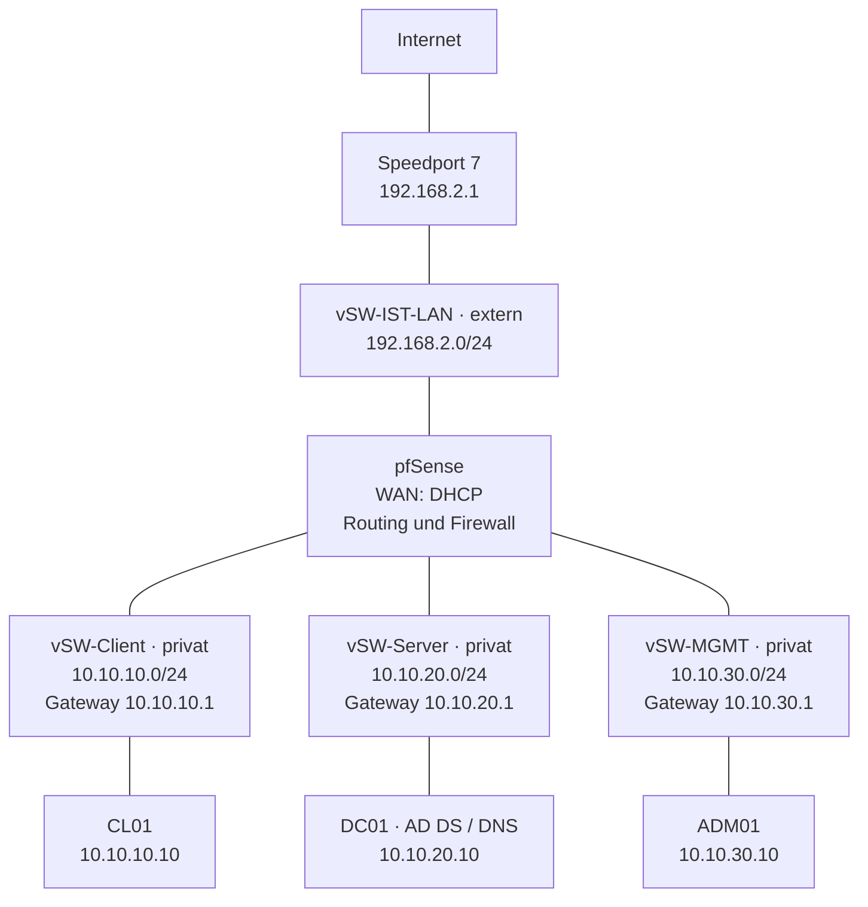

# 06 SOLL-Konzept

**Projekt:** Risikobasierte Konzeption und Umsetzung einer Netzwerksegmentierung mit pfSense in einer virtualisierten Netzwerkumgebung  
**Verfasser:** Marco Males  
**Stand:** 18.09.2026  
**Status:** Abgestimmte Zielplanung; Implementierung und Wirksamkeitsnachweise ausstehend

## 1. Ziel, Grundlagen und Abgrenzung

Die vorhandene gemeinsame Netzwerkstruktur wird in die Sicherheitszonen CLIENT, SERVER und MGMT aufgeteilt. pfSense übernimmt die Weiterleitung und zentrale Kontrolle zwischen den Zonen. Nur ausdrücklich benötigte Verbindungsaufbauten werden zugelassen. Die erforderlichen Domänenfunktionen und der berechtigte Verwaltungszugriff müssen erhalten bleiben.

Grundlagen sind die [IST-Aufnahme](<02 IST-Analyse - Final.md>), der [Schutzbedarf](<03 Schutzbedarf.md>), die [Risikoanalyse](<04_Risikoanalyse.md>) und die [Entscheidungsmatrix](<05 Entscheidungsmatrix.md>). Ausgewählt wurde Variante B: zentrale Segmentierung mit pfSense bei weiterhin aktiven Windows-Firewalls. Die gezielte doppelte Durchsetzung sämtlicher zentraler IPv4-Regeln durch zusätzliche Windows-Regeln nach Variante C ist nicht vorgesehen. Die ausdrücklich vereinbarten Windows-Maßnahmen zu IPv6, Anmeldung, NLA, Berechtigungen und Updates bleiben Bestandteil des Konzepts.

Die Umgebung bildet ein kleines Bürounternehmen nach. Hyper-V dient als Laborplattform. Der gemeinsame Host stellt keine Annahme dar, dass sämtliche Arbeitsplätze eines realen Unternehmens auf einem einzigen Rechner betrieben werden.

Die pfSense-VM ist im erhobenen IST lediglich vorbereitet und nicht in den Kommunikationsweg eingebunden. Alle folgenden Aussagen beschreiben den geplanten Zustand. Dieses Dokument behauptet keine bereits erfolgte Umsetzung oder erfolgreiche Abnahme.

## 2. Zielarchitektur und Netzplan

### 2.1 Virtuelle Anbindung

pfSense erhält vier virtuelle Netzwerkadapter. Die drei Windows-Systeme erhalten jeweils eine aktive Verbindung zu ihrem vorgesehenen privaten Switch. Ihre bisherige Verbindung zu vSW-IST-LAN wird bei der Umstellung entfernt. Weitere aktive Adapter dürfen keine Umgehung der Segmentierung ermöglichen.

| Hyper-V-Switch | Typ | Angeschlossene Systeme | Aufgabe |
|---|---|---|---|
| vSW-IST-LAN | Extern, bestehend | pfSense-WAN; vorhandene Host-/Routeranbindung | Verbindung zum Speedport im Netz 192.168.2.0/24 |
| vSW-Client | Privat | CL01 und pfSense-CLIENT | Benutzerzone |
| vSW-Server | Privat | DC01 und pfSense-SERVER | Zentrale AD-/DNS-Dienste |
| vSW-MGMT | Privat, neu anzulegen | ADM01 und pfSense-MGMT | Administration |

Die Trennung erfolgt über separate virtuelle Switches und pfSense-Adapter. VLAN-Trunking ist für diesen Aufbau nicht vorgesehen. Der Hyper-V-Default-Switch wird nicht als zusätzlicher Zugang für die Projekt-VMs verwendet.

**Abbildung 1:** Geplante Topologie. Linien stellen physische beziehungsweise virtuelle Anbindungen dar, keine pauschalen Verkehrsfreigaben. Alle Projekt-VMs laufen auf MALES-IT. Die privaten Switches bieten dem Host keine eigene normale Netzschnittstelle; der unabhängige Verwaltungsweg für Störungen bleibt die Hyper-V-Konsole.

### 2.2 Adressplan

| Objekt | IPv4-Adresse | Präfix / Maske | Standardgateway | DNS |
|---|---|---|---|---|
| pfSense-WAN | DHCP vom Speedport | Vom Router | Vom Router | 192.168.2.1, ausdrücklich festgelegt |
| pfSense-CLIENT | 10.10.10.1 | /24 · 255.255.255.0 | Kein separates internes Gateway | – |
| pfSense-SERVER | 10.10.20.1 | /24 · 255.255.255.0 | Kein separates internes Gateway | – |
| pfSense-MGMT | 10.10.30.1 | /24 · 255.255.255.0 | Kein separates internes Gateway | – |
| CL01 | 10.10.10.10 | /24 · 255.255.255.0 | 10.10.10.1 | 10.10.20.10 |
| DC01 | 10.10.20.10 | /24 · 255.255.255.0 | 10.10.20.1 | Eigener DNS-Dienst; IPv4-Loopback 127.0.0.1 als Planwert |
| ADM01 | 10.10.30.10 | /24 · 255.255.255.0 | 10.10.30.1 | 10.10.20.10 |

Die Windows-Adressen und internen pfSense-Adressen sind statisch. Ein interner DHCP-Dienst wird zunächst nicht benötigt. Die bei der Einrichtung tatsächlich bezogene WAN-Adresse wird dokumentiert. Vor Umsetzung ist zu prüfen, ob die Netze mit anderen verwendeten Netzen oder VPN-Verbindungen kollidieren.

### 2.3 Routing und NAT

pfSense ist der einzige vorgesehene Router zwischen den drei Sicherheitszonen. Zwischen den internen Netzen wird nicht übersetzt: Die ursprünglichen Quelladressen sollen in den Regelentscheidungen erkennbar bleiben. Für erlaubten IPv4-Verkehr über WAN ist ausgehendes NAT auf die pfSense-WAN-Adresse vorgesehen. Der Speedport stellt den weiteren Internetzugang bereit. NAT allein ersetzt keine Firewallfreigabe.

Da pfSense-WAN in einem privaten Netz liegt, muss die pfSense-Option zur pauschalen Blockierung privater Quellnetze auf WAN passend geprüft und konfiguriert werden. Daraus folgt keine allgemeine Freigabe aus dem Heimnetz. Eingehende neue WAN-Verbindungen bleiben gesperrt; Portweiterleitungen in die Projektsegmente sind nicht vorgesehen. [S02]

## 3. Grundsätze der Filterung

1. **Standardmäßig blockieren:** Nur dokumentierte Verbindungsaufbauten werden erlaubt. Nicht benötigte voreingestellte breite Freigaben werden entfernt beziehungsweise eingeschränkt.
2. **Quellen und Ziele begrenzen:** Regeln verwenden zunächst die einzelnen Systeme CL01, DC01 und ADM01. Weitere Geräte erfordern eine dokumentierte Erweiterung.
3. **Zustandsbehaftete Filterung:** Antworten auf erlaubte Verbindungen werden über den Verbindungszustand zugelassen. Eine pauschale Gegenrichtungsfreigabe ist nicht vorgesehen. [S02]
4. **Regeln am Eintrittsinterface:** Von CL01 ausgehende Verbindungen werden an CLIENT, von ADM01 ausgehende an MGMT und von DC01 ausgehende an SERVER geprüft. pfSense-eigener Verkehr wird gesondert betrachtet.
5. **Verwaltung schützen:** Die Weboberfläche ist ausschließlich von ADM01 über HTTPS erreichbar. Automatische Anti-Lockout-Regeln dürfen diese Vorgabe nicht unbemerkt erweitern. Sie werden erst nach Einrichtung und Prüfung des vorgesehenen Zugangs angepasst; die Konsole bleibt verfügbar. [S02]
6. **Keine pauschale Internetdefinition:** Freigaben für öffentliche Ziele schließen die internen Projektadressen, pfSense selbst, das Heimnetz und weitere reservierte beziehungsweise nicht öffentliche Zielbereiche aus. Eine bloße Regel zu „any“ oder „WAN net“ bildet diese Vorgabe nicht ab.
7. **Bestehende Zustände beachten:** Bei Sperrtests nach Regeländerungen werden alte Verbindungen berücksichtigt und nötigenfalls gezielt beendet. Ein bestehender Zustand darf kein irreführendes Testergebnis erzeugen.

Für die Umsetzung werden verständliche Aliase für Hosts, interne Netze, Dienstports und öffentliche Ziele verwendet. Die tatsächliche Definition und Reihenfolge werden in der Implementierungsdokumentation festgehalten. Zeitlich begrenzte Ausnahmen erhalten eine eindeutige Beschreibung.

## 4. Kommunikationsmatrix

Alle Freigaben gelten für IPv4. Angegeben sind Zielports; Quellports werden entsprechend dem jeweiligen Clientverhalten zugelassen. Die Regeln betreffen neue Verbindungen in der angegebenen Richtung. Antwortverkehr ist nach Abschnitt 3 abgedeckt.

### 4.1 Domänenfunktionen von CL01 und ADM01 zu DC01

Die folgenden Freigaben gelten ausschließlich für **CL01 und ADM01 → DC01 (10.10.20.10)**. Unterstützt werden Anmeldung, DNS, Gruppenrichtlinien, SYSVOL/NETLOGON, Zeitversorgung und Domänenbeitritt. Grundlage der Portplanung ist Microsofts Dokumentation; die erforderlichen Funktionen werden zusätzlich im Labor geprüft. [S01]

| ID | Dienst | Zielport / Protokoll | Entscheidung / Zweck |
|---|---|---|---|
| AD01 | DNS | TCP und UDP 53 | Erlauben; interne und weitergeleitete Namensauflösung |
| AD02 | Kerberos | TCP und UDP 88 | Erlauben; Authentifizierung |
| AD03 | LDAP / DC-Erkennung | TCP und UDP 389 | Erlauben; Verzeichnis- und Domänenfunktionen |
| AD04 | SMB | TCP 445 | Erlauben; SYSVOL, NETLOGON und Gruppenrichtlinien |
| AD05 | Kerberos-Kennwortänderung | TCP und UDP 464 | Erlauben; Kennwortänderungen |
| AD06 | RPC Endpoint Mapper | TCP 135 | Erlauben; Zuordnung erforderlicher RPC-Dienste |
| AD07 | Dynamisches RPC | TCP 49152–65535 | Erlauben; erforderliche RPC-Funktionen, unter anderem Netlogon und Domänenbeitritt |
| AD08 | Windows-Zeitdienst | UDP 123 | Erlauben; Domänenzeitsynchronisation |

Der breite RPC-Zielportbereich wird nicht zwischen beliebigen Netzen geöffnet. Nur die genannten Quellen dürfen ihn zu DC01 verwenden. Er ist kein Nachweis, dass alle darin erreichbaren Dienste fachlich benötigt werden; eine weitere Einschränkung erfordert eine gesonderte Dienstkonfiguration und Prüfung.

Nicht alle von Microsoft beschriebenen Ports sind in jeder Umgebung erforderlich. Global Catalog TCP 3268, LDAPS TCP 636/3269 oder weitere Verbindungen werden nicht vorsorglich pauschal freigegeben, sondern bei nachgewiesenem Bedarf begründet ergänzt. ADWS TCP 9389 für direkte Verwaltungswerkzeuge ist zunächst nicht vorgesehen, da die Administration ausschließlich über RDP erfolgt. Domänenbeitritt, Gruppenrichtlinien und Kennwortänderungen sind Funktionsprüfungen; fünf erfolgreiche TCP-Tests ersetzen diese nicht.

### 4.2 Verwaltung und Diagnose

| ID | Quelle | Ziel | Protokoll / Zielport | Entscheidung |
|---|---|---|---|---|
| V01 | ADM01 | DC01, CL01 | TCP 3389 | RDP erlauben; NLA und Zielberechtigung erforderlich |
| V02 | ADM01 | pfSense-MGMT 10.10.30.1 | TCP 443 | Webverwaltung erlauben |
| V03 | ADM01 | CL01, DC01, interne pfSense-Adressen | ICMP Echo Request | Ping erlauben |
| V04 | CL01 | DC01, pfSense-CLIENT 10.10.10.1 | ICMP Echo Request | Ping erlauben |
| V05 | CL01 | DC01, ADM01 | TCP/UDP 3389 | Blockieren; keine RDP-Freigabe |
| V06 | CL01 | ADM01 | ICMP Echo Request | Keine Freigabe |
| V07 | Alle Quellen außer ADM01 | pfSense-Verwaltung | Verwaltungszugänge | Blockieren |

Der geplante RDP-Betrieb nutzt TCP. UDP 3389 wird nicht zusätzlich freigegeben. Weitere Windows-Ziele werden erst nach ausdrücklicher Aufnahme in das Konzept ergänzt. pfSense wird über HTTPS und im Notfall über die Konsole verwaltet, nicht über RDP. SSH-Fernverwaltung ist nicht vorgesehen.

### 4.3 DNS, Zeitversorgung, Webzugriff und Updates

| ID | Quelle | Ziel | Protokoll / Zielport | Entscheidung / Bedingung |
|---|---|---|---|---|
| I01 | DC01 | Speedport 192.168.2.1 | TCP/UDP 53 | DNS-Weiterleitung erlauben |
| I02 | DC01 | pfSense-SERVER 10.10.20.1 | UDP 123 | NTP erlauben |
| I03 | CL01 | Öffentliche Internetziele | TCP 80/443 | HTTP/HTTPS erlauben; keine allgemeine interne Webfreigabe |
| I04 | DC01 | Öffentliche Internetziele | TCP 80/443 | Nur bei manuell aktivierter Updatefreigabe |
| I05 | ADM01 | Internet | Alle | Direkte Verbindungen blockieren |
| I06 | CL01, ADM01 | DNS-Ziele außer DC01 | TCP/UDP 53, TCP 853 | Keine Freigabe für externes DNS beziehungsweise DNS-over-TLS |
| I07 | pfSense selbst | Speedport 192.168.2.1 | TCP/UDP 53 | Eigene DNS-Auflösung vorsehen |
| I08 | pfSense selbst | Über 2.pfsense.pool.ntp.org ermittelte Zeitserver | IPv4, UDP 123 | Eigene Zeitsynchronisation vorsehen |
| I09 | pfSense selbst | Offizielle Updateinfrastruktur und erforderliche Hilfsdienste | Bei Einrichtung verifizieren | Updates manuell im Wartungsfenster; Verbindungen dokumentieren |
| I10 | WAN / Heimnetz | Interne Systeme und pfSense-Verwaltung | Neue eingehende Verbindungen | Blockieren; keine Portweiterleitungen |

I07–I09 beschreiben Verkehr der Firewall selbst, keine Freigaben für die dahinterliegenden Systeme. Die Filterung pfSense-eigener Verbindungen wird gesondert geprüft; normale Regeln an CLIENT/SERVER/MGMT begrenzen diesen Verkehr nicht automatisch.

Nicht aufgeführte Verbindungen bleiben blockiert. Zusätzliche für Updates oder Zertifikatsprüfungen erforderliche Verbindungen werden anhand der tatsächlichen Funktion und Herstellerangaben begründet ergänzt. Fehlende Funktion führt nicht zu einer dauerhaften pauschalen „Any-to-Any“-Freigabe.

## 5. DNS und Zeitversorgung

### 5.1 DNS

Die Domäne bleibt **ad.projekt.test**, der NetBIOS-Name bleibt **PROJEKT**. CL01 und ADM01 verwenden ausschließlich DC01 als konfigurierten DNS-Server. Der Router wird nicht als alternativer DNS-Server auf diesen Rechnern eingetragen.

DC01 verwendet den eigenen DNS-Dienst und leitet externe Anfragen an 192.168.2.1 weiter. Die Erreichbarkeit und Eignung des Routers als Weiterleiter wird nach der Segmentierung geprüft. Unbeabsichtigte alternative Auflösungswege sind zu vermeiden. pfSense verwendet den Router für ihre eigene Auflösung und ist damit hierfür nicht von DC01 abhängig. Eine automatische Übernahme abweichender DNS-Server über WAN-DHCP darf diese Festlegung nicht verändern.

Nach der Adressumstellung werden Host-, PTR- und AD-SRV-Einträge auf Konsistenz geprüft. Nicht mehr gültige Adressen werden erst nach Sicherung und eindeutiger Zuordnung bereinigt. Die dynamische Registrierung der Domänendienste wird geprüft; veraltete IPv6-Einträge dürfen nicht als funktionsfähige SOLL-Ziele bestehen bleiben.

Auf CL01 wird in Microsoft Edge die verbindliche Richtlinie **DnsOverHttpsMode = off** vorgesehen. Sie deaktiviert Edge-DNS-over-HTTPS. CL01 soll den festgelegten DNS-Weg über DC01 verwenden. Die Richtlinie ist nach Anwendung zu prüfen. Sie ist kein vollständiger Schutz gegen DNS-Tunnel anderer Anwendungen über erlaubtes HTTPS. [S05]

### 5.2 Zeitversorgung

| System | Vorgesehene Zeitquelle |
|---|---|
| pfSense | 2.pfsense.pool.ntp.org über IPv4 |
| DC01 | pfSense 10.10.20.1 |
| CL01 und ADM01 | Windows-Domänenhierarchie über DC01 |

pfSense stellt NTP intern für DC01 bereit; ein öffentlicher NTP-Dienst auf WAN ist nicht vorgesehen. Die tatsächlich ausgewählten Poolserver und der Synchronisationsstatus werden dokumentiert. [S03]

Vor Umsetzung werden die PDC-Emulatorrolle von DC01 und die tatsächlichen Windows-Zeitquellen geprüft. Die bisher beobachtete Hyper-V-Zeitsynchronisation wird berücksichtigt und so abgestimmt, dass die konfigurierte Domänenzeitversorgung nicht unbemerkt überlagert wird. Eine ungeprüfte pauschale Änderung aller Integrationsdienste ist nicht vorgesehen.

Der Host erhält weiterhin eine eigene nachgewiesene Zeitversorgung. Vor Screenshot- und Logvergleichen werden Uhrzeit, Zeitzone und Synchronisationsstatus der beteiligten Systeme festgehalten. Historische IST-Zeitstempel werden dadurch nicht rückwirkend genauer.

## 6. IPv6-Behandlung

**Verbindliches Ziel:** Die Projektkommunikation erfolgt ausschließlich über IPv4. IPv6-Netzwerkverkehr soll weder zwischen den Zonen, über WAN noch innerhalb der Windows-Segmente stattfinden. Die lokale Loopback-Funktion innerhalb eines Rechners bleibt ausgenommen.

Auf pfSense werden keine produktiven IPv6-Freigaben, IPv6-Präfixdelegation, Router Advertisements oder DHCPv6-Dienste für die Projektsegmente vorgesehen. IPv6-Verkehr wird entsprechend der Sperrvorgabe behandelt. Eine Firewall kann nur Verkehr filtern, der sie tatsächlich durchläuft; IPv6-Kommunikation innerhalb eines privaten Switches erfordert ergänzende Maßnahmen an den Endsystemen.

**Technischer Prüfauftrag vor Umsetzung:** Die konkrete Windows-Konfiguration zur Unterbindung externer IPv6-Kommunikation wird vorab festgelegt und funktional geprüft. Microsoft weist auf mögliche Funktionsprobleme beim Abschalten beziehungsweise Entbinden von IPv6 hin. Dieses Dokument ordnet daher nicht ungeprüft das Entfernen der IPv6-Bindung an. Auch eine reine IPv4-Bevorzugung erfüllt die Sperrvorgabe nicht. [S06]

Die Abnahme umfasst Konfigurationsprüfung und geeignete Beobachtung des Netzwerkverkehrs. Ein fehlgeschlagener IPv6-RDP-Test beweist weder allein eine pfSense-Blockentscheidung noch die Abwesenheit aller IPv6-Pakete. Existieren nach der Umstellung keine IPv6-Zieladresse und kein IPv6-Pfad mehr, muss das als fehlender Pfad dokumentiert werden; ein fiktiver Blockeintrag darf nicht erwartet werden. Für einen gesonderten Filtertest ist ein kontrollierter, eindeutig beschriebener Prüfaufbau nötig. Windows-Loopback wird nicht als Verletzung des Ziels gewertet.

## 7. Administrations- und Berechtigungskonzept

### 7.1 Rollen und Konten

| Konto / Gruppe | Aufgabe und Berechtigungsumfang |
|---|---|
| adm.weber | Arbeitsplatzadministration; Mitglied von GG_IT_Admins; lokale Administratorrechte auf CL01 und ADM01 |
| GG_IT_Admins | Gezielte Aufnahme in die lokalen Administratorengruppen von CL01 und ADM01 über Gruppenrichtlinien; keine pauschale Mitgliedschaft in Domänen-Admins |
| da.weber | Separates, zunächst neu vorgesehenes Konto für Domänenadministration auf DC01; konkrete privilegierte Gruppen und RDP-Rechte werden bei Umsetzung dokumentiert |
| Normale Benutzer, beispielsweise lschmidt | Keine lokale Anmeldung an ADM01; keine zusätzlichen administrativen Rechte |

Neue Administratoren erhalten lokale Rechte durch eine genehmigte Aufnahme in GG_IT_Admins. Gruppenmitgliedschaften werden bei Aufgabenwechsel oder Ausscheiden angepasst. Die Gruppenrichtlinie darf vorhandene erforderliche Administrations- und Notzugänge nicht unbeabsichtigt entfernen.

Die direkte Domänen-Adminmitgliedschaft von adm.weber war im IST entfernt worden. Diese Trennung wird beibehalten. Die neue Rolle von da.weber wird nicht als bereits eingerichtet dargestellt.

### 7.2 Verwaltungswege

ADM01 ist Ausgangspunkt für RDP auf CL01 und DC01. RSAT-Direktverwaltung ist nicht vorgesehen. Auf beiden RDP-Zielen bleibt NLA aktiviert. Geeignete Kontoberechtigungen sind zusätzlich zur Netzfreigabe erforderlich. Die bestehende lokale Anmeldebeschränkung auf ADM01 wird übernommen und nach der GPO-Anpassung erneut geprüft.

Das Konto da.weber ist für DC01-Verwaltung vorgesehen und wird nicht für gewöhnliche Arbeit oder Anmeldung an CL01 verwendet. Die Arbeit mit einem hochprivilegierten Domänenkonto von ADM01 aus macht dessen Schutz besonders wichtig: Eine Kompromittierung von ADM01 bleibt trotz getrennter Kontonamen ein Risiko für administrative Sitzungen. Eine zusätzliche Trennung in mehrere administrative Vertrauensstufen ist hier nicht umgesetzt.

Der Hyper-V-Konsolenzugang dient als unabhängiger Wiederherstellungsweg. Wer diesen Zugang besitzt und wie die Zugangsmittel erreichbar bleiben, wird vor der Umstellung geprüft. RDP aus CLIENT auf ADM01 und DC01 wird blockiert. Die vorhandenen IST-Anmeldenachweise auf ADM01 bleiben historische Nachweise und werden nicht als Beleg für die neuen Regeln verwendet.

## 8. Updateverfahren

### 8.1 DC01

DC01 lädt Updates automatisch herunter, soweit die dafür vorgesehene Internetfreigabe aktiv ist. Ein berechtigter Administrator prüft die vorgesehenen Updates und startet Installation sowie erforderlichen Neustart manuell im Wartungsfenster von ADM01 aus. Die entsprechende Windows-Update-Richtlinie wird eingerichtet und auf wirksame Einstellungen einschließlich eventueller Fristen geprüft. [S04]

Die interne IT aktiviert I04 bei Bedarf und deaktiviert die Freigabe nach dem Download. Zeitpunkte und Ergebnis werden dokumentiert. Noch vorhandene Verbindungszustände sind beim Beenden der Freigabe zu berücksichtigen. Der Pakettransfer von ADM01 zu DC01 ist damit nicht der gewählte reguläre Updateweg; eine dafür eigens vorgesehene SMB-Transferfreigabe entfällt.

**Bewusste Grenze:** I04 erlaubt während des Freigabezeitraums auch andere öffentliche HTTP-/HTTPS-Ziele. Sie erkennt nicht das Programm oder den Zweck der Verbindung. Eine zuverlässige Beschränkung ausschließlich auf Windows Update wird nicht behauptet. Ein einfacher Hostnamen-Alias mit Platzhaltern ist dafür ungeeignet; dynamische und gemeinsam genutzte Zieladressen begrenzen IP-basierte Zuordnungen zusätzlich. [S07]

### 8.2 CL01

Updates werden automatisch heruntergeladen. Installation und notwendiger Neustart werden manuell durch einen berechtigten Administrator im Wartungsfenster ausgelöst. Die vorhandene Webfreigabe ist eine Ausgangsbasis; tatsächlich benötigte Updateverbindungen werden geprüft. Ein notwendiger zusätzlicher Zugang ist vor Freigabe zu dokumentieren.

### 8.3 ADM01

ADM01 besitzt keinen direkten Internetzugang. Updatepakete werden auf einem freigegebenen Rechner aus offiziellen Quellen bezogen, hinsichtlich Herkunft und digitaler Signatur geprüft und über ein ausschließlich dafür vorgesehenes, kontrolliertes Wechselmedium übertragen. Das Medium wird auf Schadsoftware geprüft. Installation erfolgt manuell; Stand und Ergebnis werden dokumentiert. Der konkrete Beschaffungsrechner wird vor Umsetzung benannt.

### 8.4 pfSense

Interne IT und Dienstleister prüfen die vorgesehenen Updates. Vor Installation wird die Konfiguration gesichert. Installation erfolgt manuell im Wartungsfenster über den offiziellen Updateweg. Danach werden relevante Funktions- und Sperrtests wiederholt. Die benötigten Verbindungen pfSense-eigener Dienste werden bei der Einrichtung erfasst. Es wird keine automatische Internetfreigabe für ADM01 daraus abgeleitet.

## 9. Protokollierung und Konfigurationssicherung

### 9.1 Protokollierung

Blockierte Verbindungsversuche werden auf pfSense protokolliert. Für die Abnahme wird zusätzlich die Protokollierung der relevanten erlaubten Verbindungen aktiviert. Welche erfolgreichen Verbindungen anschließend dauerhaft protokolliert werden, wird anhand des Bedarfs und des Volumens festgelegt.

Nachweise enthalten Zeitpunkt und Zeitzone, Quelle, Ziel, Protokoll/Port und Regelentscheidung. Verbindungslogs belegen Netzwerkentscheidungen, keine vollständige Benutzeranmeldung. Änderungen an der Konfiguration werden gesondert mit Anlass, Bearbeiter, Gegenprüfung und Konfigurationsstand dokumentiert.

Logs können rotiert werden oder Einträge begrenzen. Relevante Testnachweise werden deshalb zeitnah exportiert. Aufbewahrungsdauer und Speicherumfang für den späteren Regelbetrieb sind noch festzulegen; eine lückenlose dauerhafte Aufzeichnung wird nicht zugesichert.

### 9.2 Sicherung

Die pfSense-Konfiguration wird verschlüsselt exportiert:

- nach abgeschlossener Ersteinrichtung;
- unmittelbar vor Änderungen;
- nach geprüften und freigegebenen Änderungen.

Die Exporte erhalten Datum, Uhrzeit und Änderungsstand. Sie werden auf ADM01 mit begrenzten Zugriffsrechten abgelegt und zusätzlich auf einem separaten verschlüsselten Sicherungsmedium gespeichert. Dieses Medium wird nur zur Sicherung angeschlossen und getrennt aufbewahrt. Es wird nicht für Updateübertragungen verwendet.

ADM01 und pfSense befinden sich auf demselben Host. Die externe Kopie ist daher für einen vom Host unabhängigen Zugriff wichtig. Die Wiederherstellungszugangsmittel müssen autorisierten Personen unabhängig von den ausgefallenen VMs zur Verfügung stehen. Ein Konfigurationsexport ist keine vollständige Sicherung aller Windows-Systeme oder des gesamten Hosts.

### 9.3 Wiederherstellungsprüfung

Vor Projektabschluss wird eine gesicherte pfSense-Konfiguration in einem geplanten Testfenster wiederhergestellt. Hyper-V-Konsole und Wiederherstellungszugang bleiben verfügbar. Anschließend werden DNS-, erlaubte RDP- und Sperrtests wiederholt. Ablauf, Dauer, verwendete Sicherung und Ergebnisse werden dokumentiert.

Der Test belegt die geprüfte Konfigurationswiederherstellung, keine beliebige vollständige Wiederherstellung nach jedem Hardware- oder Datenträgerverlust. Ein kontrollierter Neustart beziehungsweise Ausfalltest nach R05b ist davon getrennt zu dokumentieren.

## 10. Umstellungs- und Rückfallplan

### 10.1 Voraussetzungen

Vor Beginn des eigentlichen Umstellungsfensters werden folgende Punkte erledigt:

1. Aktuelle Adapter-, Switch-, IP-, DNS-, GPO- und Kontoeinstellungen erfassen und geeignete Sicherungen beziehungsweise Rücksetzverfahren vorbereiten.
2. pfSense und die privaten Switches vorbereiten; Adapter anhand eindeutiger Merkmale wie MAC-Adressen zuordnen und im Vier-Augen-Prinzip gegenprüfen.
3. Unabhängigen Konsolenzugang und benötigte Zugangsmittel testen.
4. Freigabe-, Test- und Rückfallschritte vorbereiten; Netzüberschneidungen ausschließen.
5. Rückkehr zur bisherigen DC01-Adresse 192.168.2.139 absichern. Da diese im IST per DHCP bezogen wurde, ist die tatsächliche Wiederzuweisung beziehungsweise eine konfliktfreie Reservierung vorher zu klären.
6. Sicherstellen, dass die Rückfallreserve realistisch ist. Noch ungeprüfte Sicherungs- oder Wiederherstellungsannahmen gelten nicht als erfüllte Voraussetzung.

### 10.2 Durchführung

Die Windows-VMs werden gemeinsam in einem angekündigten Wartungsfenster umgestellt:

1. Ausgangszustand und Beginn dokumentieren.
2. DC01 auf vSW-Server, CL01 auf vSW-Client und ADM01 auf vSW-MGMT umschalten.
3. Statische Adressen, Gateways und DNS-Einstellungen gemäß Adressplan eintragen.
4. Vorbereitete pfSense-Regeln, NAT und Infrastrukturkonfiguration prüfen.
5. DNS-Registrierung und veraltete Einträge kontrolliert korrigieren.
6. Pflichtprüfungen aus Abschnitt 11 durchführen und Ergebnisse bewerten.
7. Erst bei erfolgreichen Pflichtprüfungen den neuen Zustand freigeben.

### 10.3 Zeitrahmen und Abbruchentscheidung

| Planwert | Festlegung |
|---|---|
| Wartungsfenster | 120 Minuten |
| Spätester Entscheidungspunkt | Nach 90 Minuten |
| Reserve | 30 Minuten für Rückfall und Funktionsprüfung |

Diese Werte sind eine Planung, keine bereits gemessenen Zeiten. Die 30-Minuten-Reserve wird vorab überprüft. Ist sie nicht ausreichend, wird das Wartungsfenster vor Beginn angepasst; der Rückfall darf nicht erst bei vollständigem Zeitverbrauch begonnen werden. Vorbereitung, Nachbearbeitung und zusätzlicher Wiederherstellungstest müssen im 80-Stunden-Gesamtbudget berücksichtigt werden. Der konkrete Termin ist noch festzulegen.

### 10.4 Rückfall

Sind Pflichtprüfungen nicht erfolgreich und ist keine rechtzeitige Behebung möglich, wird nicht freigegeben. Die Windows-VMs werden wieder mit vSW-IST-LAN verbunden. Die zuvor dokumentierten Netz-, DNS- und gegebenenfalls für den Rückfall relevanten Richtlinieneinstellungen werden wiederhergestellt. Geänderte DNS-Einträge werden zum tatsächlichen Rückfallzustand passend korrigiert.

Die vorherige Erreichbarkeit von DC01, interne DNS-Auflösung und benötigte Windows-Funktionen werden anschließend mit den bisherigen IST-Tests geprüft. pfSense verbleibt nicht unbemerkt als zusätzlicher alternativer Router im alten Aufbau. Der Rückfall wird dokumentiert und stellt den bisherigen Betrieb wieder her; er ist keine erfolgreiche Umsetzung der Segmentierung.

## 11. Prüf- und Freigabeplan

Alle folgenden Prüfungen sind geplant. Tests werden mit Start-/Endzeit, Quelle, Ziel, Befehl beziehungsweise Handlung, erwartetem und tatsächlichem Ergebnis sowie zugehöriger Nachweisdatei dokumentiert. Screenshots ergänzen Rohdaten und Logs. Der neue Adressplan wird dem historischen IST eindeutig gegenübergestellt.

| Prüf-ID | Prüfung | Erwartetes Ergebnis / Nachweis |
|---|---|---|
| S01 | Adapter, Netze, Routing und Namensauflösung | Adressplan umgesetzt; keine zusätzliche aktive Anbindung der Windows-VMs an das alte LAN |
| S02 | Interne Host- und AD-SRV-Abfragen von CL01 und ADM01 | Richtige SOLL-Adressen und SRV-Ziele; keine Zeitüberschreitung |
| S03 | Domänenanmeldung, Gruppenrichtlinien, SYSVOL/NETLOGON, Kennwortänderung und kontrollierter Domänenbeitrittstest | Vereinbarte Funktionen erfolgreich; Testkonto/-rechner und Rücksetzung vorbereitet |
| S04 | ADM01 → DC01 und CL01, RDP | Verbindung und Anmeldung mit jeweils berechtigtem Konto; NLA aktiv |
| S05 | CL01 → DC01 und ADM01, RDP | Blockiert; passende pfSense-Regelentscheidung |
| S06 | pfSense-Webverwaltung | Von ADM01 erreichbar, von anderen vorgesehenen Prüfquellen nicht erreichbar |
| S07 | Pingfreigaben | ADM01 erreicht interne Ziele; CL01 erreicht nur die vereinbarten Diagnoseziele |
| S08 | Web- und DNS-Verhalten von CL01 | Webzugriff funktioniert; interner DNS-Weg und Edge-Richtlinie nachgewiesen |
| S09 | Internetzugang ADM01 und Updateausnahme DC01 | ADM01 gesperrt; DC01-Webzugang nur während aktivierter Ausnahme; Deaktivierung geprüft |
| S10 | Updateverfahren | Automatischer Download und manuell ausgelöste Installation gemäß Rollen; Ergebnisse dokumentiert |
| S11 | IPv6-Sperrvorgabe | Konfiguration und geeignete Netzbeobachtung belegen den vereinbarten Umfang; fehlender Pfad und Firewallblock werden unterschieden |
| S12 | Zeitquellen und Protokollierung | Aktive Quellen nachvollziehbar; Windows- und pfSense-Nachweise zeitlich zuordenbar |
| S13 | Konten und Gruppen | adm.weber lokal berechtigt auf CL01/ADM01; Domänenrolle getrennt; normaler Benutzer lokal auf ADM01 abgewiesen |
| S14 | Verschlüsselte Sicherungen | Export auf ADM01 und externe Kopie vorhanden; Zugriff und Entschlüsselbarkeit für zuständige IT überprüft |
| S15 | pfSense-Konfigurationswiederherstellung | Vor Projektabschluss erfolgreich; danach S02, S04–S06 und relevante weitere Tests wiederholt |

S01–S14 bilden die Abnahmegrundlage entsprechend ihrem benötigten Umfang. Prüfungen, die gefahrlos vorbereitet werden können, werden vor dem Umschaltfenster durchgeführt und bei betroffenen Änderungen erneut kontrolliert. Ein Domänenbeitrittstest wird nicht improvisiert durch ungesichertes Entfernen eines produktiv benötigten Kontos oder Rechners durchgeführt. Auswahl des Testobjekts und Zeitbedarf sind vorab festzulegen.

**Freigabe:** Fehlgeschlagene Pflichtprüfungen verhindern die Freigabe. S15 erfolgt zusätzlich vor Projektabschluss im vorgesehenen Testfenster. Geeignete bestehende Sitzungen oder zwischengespeicherte Informationen dürfen keine erfolgreiche neue Anmeldung beziehungsweise DNS-Auflösung vortäuschen. Ein TCP-Ergebnis allein belegt weder UDP-Funktion noch eine erfolgreiche Anmeldung.

## 12. Verantwortlichkeiten, Restrisiken und offene Umsetzungspunkte

Die interne IT koordiniert Änderungen, Freigaben, Updates, Sicherungen und Nachweise. Der externe Dienstleister unterstützt Konfiguration, Diagnose und Wiederherstellung. Relevante Änderungen werden durch eine zweite fachkundige Person geprüft. Die zuständige Unternehmensleitung entscheidet über verbleibende betriebliche Risiken; die Konzeptauswahl ersetzt diese Entscheidung nicht.

Die Risiken aus Kapitel 04 bleiben maßgeblich. Segmentierung verhindert keinen updatebedingten DC01-Ausfall. Die zentrale pfSense bleibt eine Ausfallabhängigkeit. Ein kompromittierter ADM01 mit geeigneten Konten kann erlaubte Verwaltungswege missbrauchen. Die zeitweise Webfreigabe von DC01 ist ausdrücklich breiter als eine ausschließlich anwendungsbezogene Updatefreigabe.

Vor Umsetzung beziehungsweise Freigabe sind insbesondere zu erledigen:

- Windows-IPv6-Maßnahmen mit Herstellerhinweisen und Funktionsprüfungen konkretisieren.
- Tatsächliche AD-Abhängigkeiten und gegebenenfalls zusätzliche Ports anhand der vereinbarten Funktionen prüfen.
- Updateziele und Hilfsverbindungen von CL01 und pfSense sowie wirksame Windows-Update-Richtlinien prüfen.
- Genaue privilegierte Mitgliedschaften und Anmelderechte von da.weber festlegen; Notzugänge erhalten.
- PDC-Rolle, Hyper-V-Zeitintegration, Router-DNS und externe NTP-Synchronisation prüfen.
- Rückfall auf die bisherige DC01-Adresse, Testobjekt für Domänenbeitritt und Machbarkeit des Zeitplans klären.
- Beschaffungsrechner für Offlineupdates, Sicherungsablage, unabhängige Zugangsmittel und Logaufbewahrung konkret benennen.

Diese Punkte sind keine stillschweigenden Freigaben für zusätzliche Dienste. Ergebnisse werden in [07 Implementierung](<07 Implementierung.md>) und [08 Testprotokoll](<08 Testprotokoll.md>) dokumentiert. Die abschließende Bewertung folgt in [09 Restrisiko](<09 Restrisiko.md>).

## 13. Quellen- und Entscheidungsverzeichnis

### Projektinterne Grundlagen

| Quelle | Verwendung |
|---|---|
| [02 IST-Analyse – Final](<02 IST-Analyse - Final.md>) mit Primärnachweisen | Ausgangsadressen, Topologie, Erreichbarkeit, Benutzer- und Zeitbefunde |
| [03 Schutzbedarf](<03 Schutzbedarf.md>) | Schutzanforderungen des Bürounternehmensmodells |
| [04 Risikoanalyse](<04_Risikoanalyse.md>) | R01–R05b, Maßnahmen, Rückfall und Restrisiken |
| [05 Entscheidungsmatrix](<05 Entscheidungsmatrix.md>) | Auswahl von Variante B und Abgrenzung zu C |
| Abgestimmter Projektdialog mit Marco Males; in diesem Dokument festgehalten | Netze, Adressen, Freigaben, Konten, Updates, Sicherung und Zeitplanung |

### Technische Referenzen

Die Quellen unterstützen technische Planungsdetails. Sie belegen keine bereits erfolgreiche Umsetzung in dieser Umgebung. Die konkrete Konfiguration ist anhand der eingesetzten Versionen zu überprüfen.

| Kennung | Quelle | Verwendung |
|---|---|---|
| S01 | [Microsoft: Firewall für Active Directory und Vertrauensstellungen](https://learn.microsoft.com/en-us/troubleshoot/windows-server/active-directory/config-firewall-for-ad-domains-and-trusts) | Protokoll- und Portgrundlage; szenarioabhängiger Bedarf |
| S02 | [Netgate: Rule Methodology](https://docs.netgate.com/pfsense/en/latest/firewall/rule-methodology.html) und [Firewall Fundamentals](https://docs.netgate.com/pfsense/en/latest/firewall/fundamentals.html) | Zustandsprüfung, Anti-Lockout und private WAN-Netze |
| S03 | [Netgate: NTPD](https://docs.netgate.com/pfsense/en/latest/services/ntpd/index.html) und [General Configuration Options](https://docs.netgate.com/pfsense/en/latest/config/general.html) | NTP-Dienst und vorgesehener Zeitserverpool |
| S04 | [Microsoft: Gruppenrichtlinien für automatische Updates](https://learn.microsoft.com/en-us/windows-server/administration/windows-server-update-services/deploy/4-configure-group-policy-settings-for-automatic-updates) | Automatischer Download mit Benachrichtigung zur Installation |
| S05 | [Microsoft Edge: DnsOverHttpsMode](https://learn.microsoft.com/en-us/deployedge/microsoft-edge-policies/dnsoverhttpsmode) | Verbindlicher Modus off |
| S06 | [Microsoft: Configure IPv6 in Windows](https://learn.microsoft.com/en-us/troubleshoot/windows-server/networking/configure-ipv6-in-windows) | Funktions- und Supportgrenzen einer IPv6-Deaktivierung |
| S07 | [Netgate: Alias Features and Limitations](https://docs.netgate.com/pfsense/en/latest/firewall/aliases-features.html) | Grenzen von Hostnamen-Aliasen und dynamischen Zieladressen |

Die Referenzen wurden im Rahmen der Konzeptarbeit herangezogen; die Edge- und IPv6-Hinweise wurden am 18.09.2026 erneut geprüft. Die Risikoeinschätzungen, konkreten Freigaben und Zeitbudgets sind eigene projektbezogene Festlegungen.
