# 07 Implementierung – Zwischenstand

**Projekt:** Netzwerksegmentierung mit pfSense in einer virtualisierten Netzwerkumgebung  
**Verfasser:** Marco Males  
**Stand:** 22.09.2026, einschließlich NTP-Kontrolle, Kennwortänderung und externer Offline-Sicherung  
**Status:** Implementierung läuft; keine abschließende Abnahme

## 1. Ausgangspunkt

Die Umsetzung erfolgt auf dem Hyper-V-Host **MALES-IT** anhand des [SOLL-Konzepts](<06 SOLL_Konzept.md>). Zunächst werden pfSense installiert und die internen Schnittstellen vorbereitet. Anschließend wird ADM01 in das Management-Netz umgestellt, um die weitere Konfiguration über die Weboberfläche durchzuführen.

Im früheren IST-Nachweis war bereits eine vorbereitete pfSense-VM aufgeführt. Zu Beginn der jetzigen Implementierung wurde angegeben, dass keine entsprechende VM vorhanden ist. Für diese Durchführung wurde deshalb eine neue VM angelegt. Der historische IST-Nachweis wird dadurch nicht rückwirkend geändert.

Diese Zwischenfassung beruht auf der eigenen Obsidian-Mitschrift, den übermittelten Konsolenausgaben und Screenshots. Sie dokumentiert den erreichten Zustand. Noch nicht belegte Konfigurationen oder Prüfungen werden nicht als abgeschlossen dargestellt.

## 2. Privaten Management-Switch anlegen

Die Switches **vSW-IST-LAN**, **vSW-Client** und **vSW-Server** waren bereits aus der IST-Aufnahme bekannt. Der Management-Switch wurde ergänzt:

1. Im Hyper-V-Manager den **Manager für virtuelle Switches** öffnen.
2. **Neuer virtueller Netzwerkswitch → Privat** auswählen.
3. Den Namen **vSW-MGMT** vergeben und mit **OK** speichern.

Die privaten Switches bilden die späteren Sicherheitszonen. Die Windows-VMs wurden zu diesem Zeitpunkt noch nicht gemeinsam umgestellt.

## 3. pfSense-VM erstellen

Die virtuelle Maschine wurde unter dem Namen **pfsense** angelegt. Laut Mitschrift wurde Generation 2 gewählt und dynamischer Arbeitsspeicher deaktiviert.

| Einstellung | Dokumentierter Stand |
|---|---|
| Host | MALES-IT |
| VM-Name | pfsense |
| Generation | Generation 2 laut Mitschrift |
| Arbeitsspeicher | 4096 MB |
| Virtuelle Prozessoren | 7 laut Hardwareübersicht |
| Virtuelle Festplatte | pfsense.vhdx |
| Festplattengröße | 32 GB in der Mitschrift; im Installer als 34G angezeigt. Die VHDX-Größe in Bytes wurde noch nicht separat geprüft. |
| Secure Boot | Vor dem Start deaktiviert |

Die sieben virtuellen Prozessoren sind der tatsächlich sichtbare Stand, keine zuvor begründete Dimensionierung. Ihre Zuweisung bleibt bei der späteren Dokumentationsprüfung zu berücksichtigen. Der sichtbare Smart-Paging-Pfad `C:\HyperV\pfsense` belegt nicht automatisch den Speicherort aller VM-Dateien.

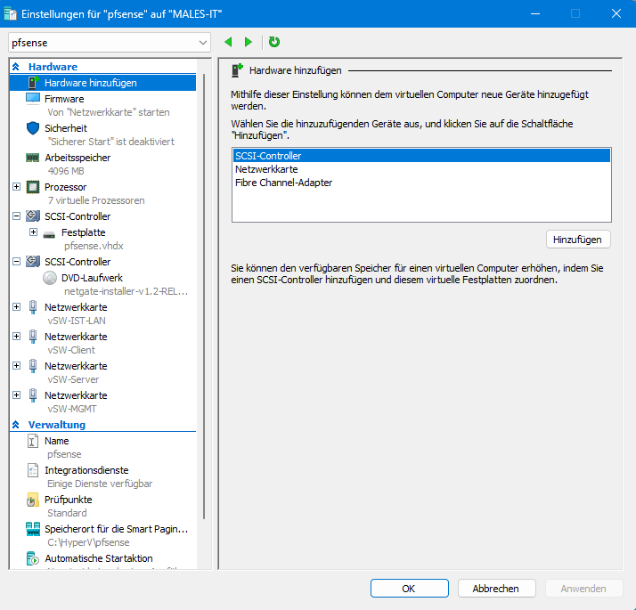

### 3.1 Installationsmedium

Verwendet wurde **Netgate Installer v1.2-RELEASE für AMD64**. Die bereits entpackte ISO lag unter:

```text
C:\Users\MMale\Downloads\netgate-installer-v1.2-RELEASE-amd64.iso\netgate-installer-v1.2-RELEASE-amd64.iso
```

Die ISO wurde als virtuelles DVD-Medium eingebunden. Die Versionsnummer des Installers ist von der später installierten pfSense-Version zu unterscheiden.

### 3.2 Virtuelle Netzwerkadapter zuordnen

Für jede Zone wurde ein eigener virtueller Netzwerkadapter hinzugefügt. Vor dem ersten Start zeigte die PowerShell-Abfrage noch Nullwerte als MAC-Adressen. Nach dem Start wurden gültige Adressen angezeigt:

```powershell
Get-VMNetworkAdapter -VMName 'pfsense' |
    Select-Object Name, SwitchName, MacAddress |
    Format-Table -AutoSize
```

Die Ausgabe wurde mit den MAC-Adressen im Installer abgeglichen. Daraus ergab sich:

| Rolle | Hyper-V-Switch | Adapter in pfSense | MAC-Adresse |
|---|---|---|---|
| WAN | vSW-IST-LAN | hn0 | 00:15:5d:02:e2:45 |
| CLIENT | vSW-Client | hn1 | 00:15:5d:02:e2:46 |
| SERVER | vSW-Server | hn2 | 00:15:5d:02:e2:47 |
| MGMT | vSW-MGMT | hn3 | 00:15:5d:02:e2:48 |

Die Zuordnung wurde damit anhand der MAC-Adressen und nicht ausschließlich anhand der Reihenfolge vorgenommen.

## 4. pfSense installieren

Im Installer wurde **hn0 als WAN** ausgewählt. Die IPv4-Konfiguration blieb auf **DHCP**, VLAN-Tagging wurde nicht verwendet. Als LAN-Schnittstelle wurde **hn3** gewählt. Diese Schnittstelle ist für das Management vorgesehen; „LAN“ bezeichnet hier die pfSense-Rolle und nicht die CLIENT-Zone.

Die Installation wurde mit folgenden Einstellungen durchgeführt:

1. **Install CE** auswählen.
2. **ZFS** als Dateisystem und **GPT** als Partitionsschema verwenden.
3. **Stripe – No Redundancy** für den einzelnen virtuellen Datenträger wählen.
4. Den Datenträger **da0, 34G, Msft Virtual Disk** auswählen.
5. **pfSense CE 2.9.0** als angebotene stabile Version auswählen.
6. Installation ausführen und anschließend neu starten.

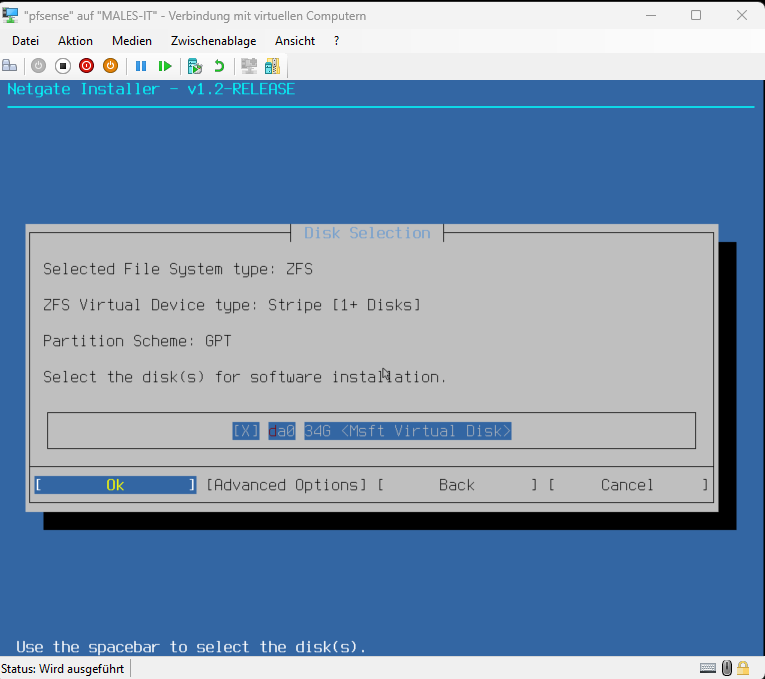

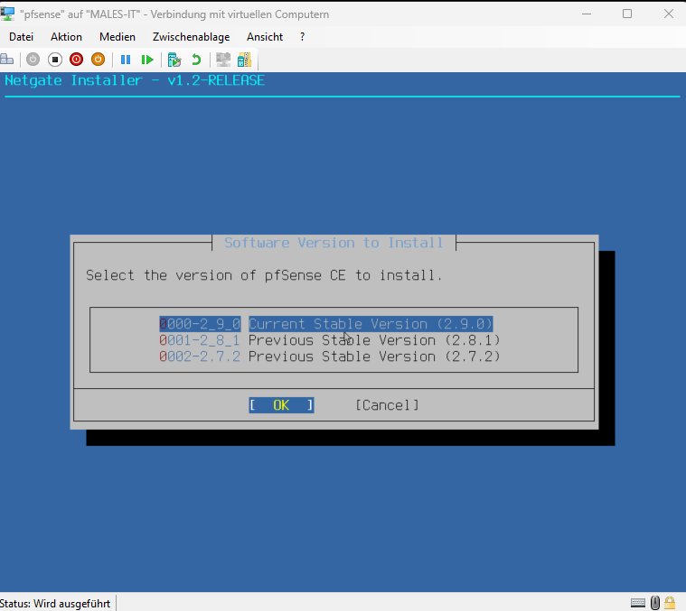

Nach dem Neustart zeigte die Konsole **pfSense 2.9.0-RELEASE (amd64)**. WAN hatte die IPv4-Adresse **192.168.2.141/24** per DHCP und zunächst zusätzlich eine IPv6-Adresse erhalten. LAN auf hn3 hatte zunächst die Standardadresse **192.168.1.1/24**.

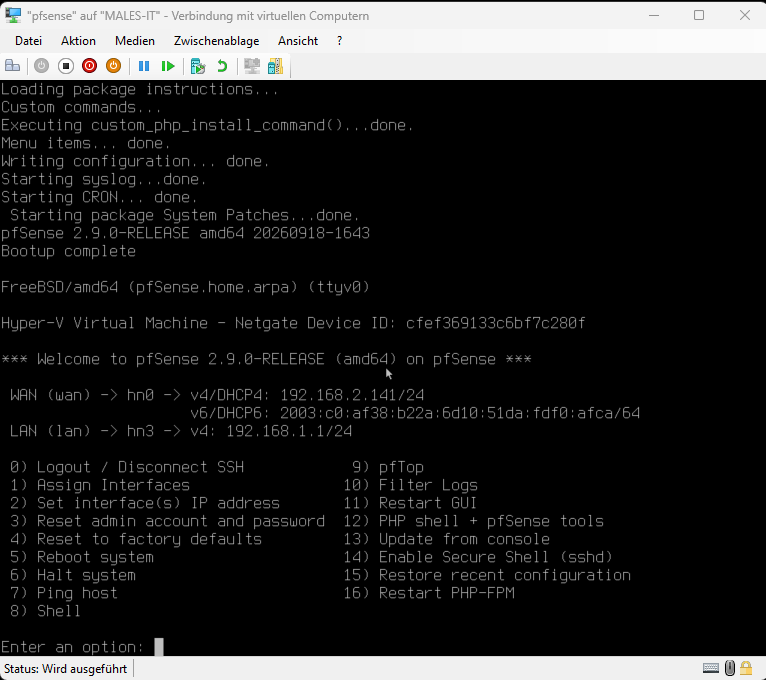

Die WAN-Adresse entsprach der bisherigen statischen Adresse von ADM01. Damit bestand ein möglicher Adresskonflikt im alten Netz. Mit der späteren dokumentierten Umstellung von ADM01 entfiel dessen bisherige Adressbelegung. Ein tatsächlich aufgetretener Konflikt wurde nicht durch einen gesonderten Test nachgewiesen.

## 5. Schnittstellen und IP-Adressen einrichten

### 5.1 Management konfigurieren

In der Konsole wurde **2 – Set interface(s) IP address** aufgerufen und **LAN / hn3** ausgewählt:

- IPv4 per DHCP: **nein**.
- Statische Adresse: **10.10.30.1**, Präfix **24**.
- Upstream-Gateway: **leer lassen**.
- DHCPv6: **nein**, manuelle IPv6-Adresse leer lassen.
- DHCP-Server auf LAN: **nein**.
- Umstellung der Weboberfläche auf HTTP: **nein**, HTTPS beibehalten.

### 5.2 Zusätzliche Schnittstellen zuweisen

Unter **1 – Assign Interfaces** wurde die Einrichtung von VLANs verneint. Die Zuordnung wurde wie folgt bestätigt:

```text
WAN  → hn0
LAN  → hn3
OPT1 → hn1
OPT2 → hn2
```

Anschließend wurden über Menüpunkt 2 auch OPT1 und OPT2 mit statischen IPv4-Adressen eingerichtet. Für die internen Netze wurde kein Upstream-Gateway eingetragen. DHCPv6 und interne DHCP-Server wurden gemäß Mitschrift nicht aktiviert.

### 5.3 IPv6-Konfiguration auf WAN entfernen

Für WAN blieb IPv4-DHCP aktiv. DHCPv6 wurde deaktiviert und keine manuelle IPv6-Adresse eingetragen. In der anschließenden Konsolenübersicht wurden nur noch folgende IPv4-Adressen angezeigt:

| Rolle | Zuordnung | IPv4-Adresse |
|---|---|---|
| WAN | hn0 | 192.168.2.141/24, DHCP zum Aufnahmezeitpunkt |
| MGMT | LAN / hn3 | 10.10.30.1/24 |
| CLIENT | OPT1 / hn1 | 10.10.10.1/24 |
| SERVER | OPT2 / hn2 | 10.10.20.1/24 |

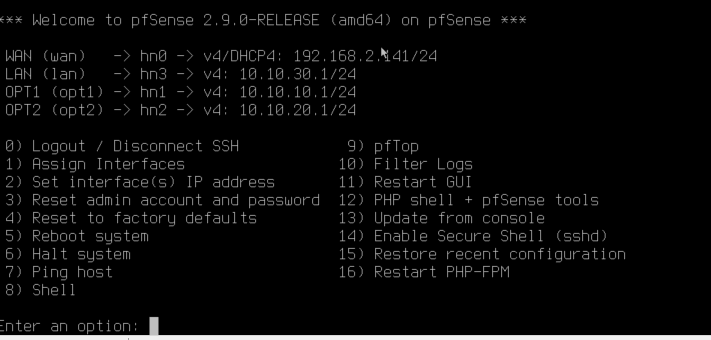

**Aussagegrenze:** Diese Übersicht belegt noch keine vollständige IPv6-Sperre auf pfSense und den Windows-Systemen. Die Endgeräte- und Filtermaßnahmen sowie deren Prüfung stehen aus.

## 6. ADM01 in das Management-Netz umstellen

Im Hyper-V-Manager wurde die Netzwerkkarte von ADM01 dem **vSW-MGMT** zugeordnet. Die Anmeldung erfolgte laut Mitschrift zunächst als **PROJEKT\Administrator**. Unter **Einstellungen → Netzwerk und Internet → Ethernet → IP-Zuweisung → Bearbeiten** wurden die IPv4-Einstellungen manuell angepasst:

| Einstellung | Wert |
|---|---|
| IPv4-Adresse | 10.10.30.10 |
| Subnetzmaske | 255.255.255.0 / Präfix 24 |
| Gateway | 10.10.30.1 |
| DNS-Server | 10.10.20.10 |
| Alternativer DNS-Server | Kein Eintrag vorgesehen |

Die PowerShell-Kontrolle in der Mitschrift zeigte **ADM01**, die Adresse **10.10.30.10**, Präfix **24**, `PrefixOrigin: Manual`, Gateway **10.10.30.1** und DNS **10.10.20.10**. Das Netzwerkprofil wurde als **Netzwerk 2** angezeigt.

Der DNS-Eintrag war damit vorbereitet. Eine Erreichbarkeit von DC01 unter seiner künftigen Adresse war zu diesem Zeitpunkt noch nicht nachgewiesen. Eine Umstellung von DC01 und CL01 ist in diesem Zwischenstand nicht dokumentiert.

### 6.1 HTTPS-Erreichbarkeit prüfen

Auf ADM01 wurde ausgeführt:

```powershell
Test-NetConnection 10.10.30.1 -Port 443 |
    Select-Object RemoteAddress, RemotePort, TcpTestSucceeded
```

Ergebnis:

```text
RemoteAddress RemotePort TcpTestSucceeded
------------- ---------- ----------------
10.10.30.1           443             True
```

Damit konnte ADM01 eine TCP-Verbindung zur Weboberfläche aufbauen. Anschließend wurde https://10.10.30.1 in Edge geöffnet und die erfolgreiche Anmeldung mit dem voreingestellten Administrationskonto gemeldet. Kennwörter werden nicht in diese Dokumentation übernommen.

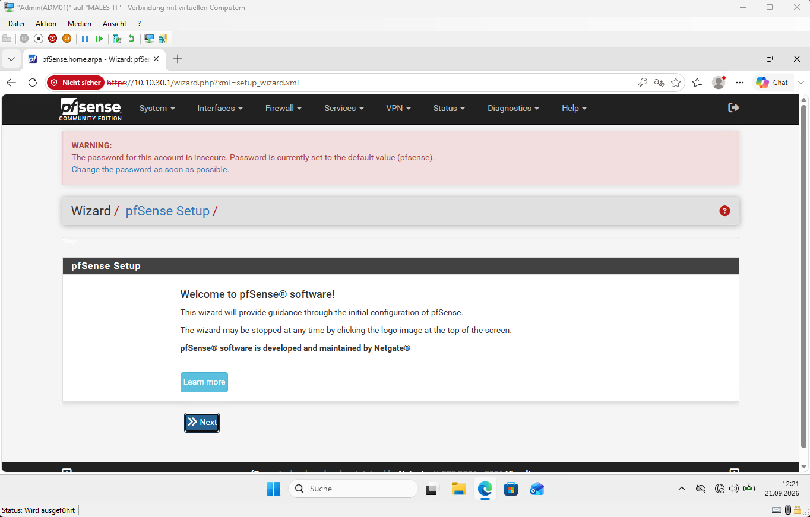

Der Browser zeigte eine Zertifikatswarnung. Der erfolgreiche Aufruf belegt deshalb nicht die Einrichtung einer vertrauenswürdigen Zertifikatskette. Die Beschränkung der Webverwaltung ausschließlich auf ADM01 ist ebenfalls noch nicht als Firewallregel nachgewiesen.

## 7. Einrichtungsassistent und Grundkonfiguration

Im Assistenten wurden laut Mitschrift folgende Werte verwendet:

| Bereich | Einstellung |
|---|---|
| Hostname | pfsense |
| Domain | ad.projekt.test |
| Primärer DNS-Server | 192.168.2.1 |
| Sekundärer DNS-Server | Leer |
| DNS Server Override | Deaktiviert |
| NTP-Hostname | 2.pfsense.pool.ntp.org |
| Zeitzone | Europe/Berlin |
| WAN IPv4 | DHCP |
| LAN/MGMT | 10.10.30.1/24 |

Der Gerätename lautet damit **pfsense.ad.projekt.test**. Dies ist kein Beitritt zur Active-Directory-Domäne. Die Zeitquelle wurde konfiguriert; eine erfolgreiche NTP-Synchronisation ist noch nicht nachgewiesen.

Das Ersetzen des Standardkennworts wurde als notwendiger Schritt besprochen. Eine ausdrückliche Bestätigung der erfolgreichen Änderung liegt im bisherigen Verlauf nicht vor. Der Punkt bleibt zur Kontrolle offen; das Kennwort selbst wird nicht angefordert oder dokumentiert.

Auf der Update-Seite erschien zwischenzeitlich die Meldung, dass bereits eine weitere Instanz von `pfSense-upgrade` läuft. Daraus lässt sich keine erfolgreich durchgeführte zusätzliche Aktualisierung ableiten. Dokumentierter installierter Stand bleibt **2.9.0-RELEASE**.

## 8. WAN kontrollieren und interne Interfaces benennen

Unter **Interfaces → WAN** wurden folgende Werte anhand der Screenshots geprüft:

- Interface aktiviert; IPv4 **DHCP**, IPv6 **None**.
- Keine abweichende MAC-Adresse; MTU und MSS leer.
- **Block private networks and loopback addresses** deaktiviert, passend zum privaten WAN-Netz am Router.
- **Block bogon networks** aktiviert.

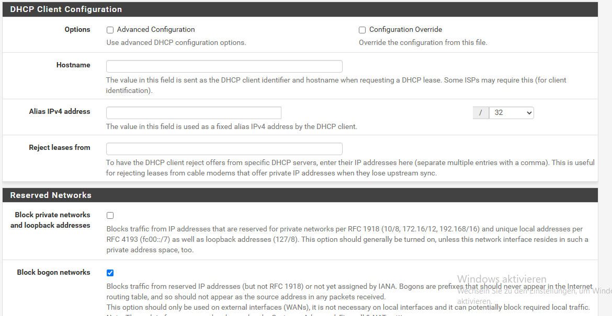

Die deaktivierte Sperre privater Quellnetze ersetzt keine Firewallfreigabe für eingehende Verbindungen.

Anschließend wurden die internen Beschreibungen geändert und die Fertigstellung gemeldet:

| Bisherige Bezeichnung | Neue Beschreibung | Adapter | Adresse |
|---|---|---|---|
| LAN | MGMT | hn3 | 10.10.30.1/24 |
| OPT1 | CLIENT | hn1 | 10.10.10.1/24 |
| OPT2 | SERVER | hn2 | 10.10.20.1/24 |

Für die internen Schnittstellen wurden statische IPv4-Adressen, IPv6 **None** und Upstream-Gateway **None** vorgesehen. Die pauschalen Sperroptionen für private und Bogon-Netze bleiben dort deaktiviert. Die endgültige Übersicht aller umbenannten Interfaces kann später zusätzlich gesichert werden.

## 9. DNS-Weiterleitung und erste Funktionskontrolle

Unter **Services → DNS Resolver** war **Enable Forwarding Mode** zunächst nicht aktiviert. Die Aktivierung mit anschließendem **Save / Apply Changes** wurde angewiesen. Ein nachträglicher Screenshot des aktivierten Kontrollfelds liegt noch nicht vor.

Unter **System → General Setup** wurde danach bestätigt, dass **192.168.2.1** als DNS-Server eingetragen und **DNS Server Override** deaktiviert ist.

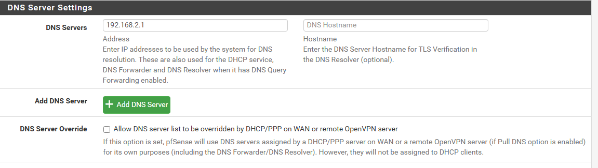

### 9.1 Externe Namensauflösung

Unter **Diagnostics → DNS Lookup** wurde im Ablauf die Abfrage von **www.netgate.com** veranlasst. Der übermittelte Ergebnisausschnitt zeigte:

| Typ | Ergebnis |
|---|---|
| A | 199.60.103.30 |
| A | 199.60.103.226 |
| AAAA | 2606:2c40::c73c:67e2 |
| AAAA | 2606:2c40::c73c:671e |
| CNAME | 1826203.group3.sites.hubspot.net |
| CNAME | group3.sites.hscoscdn00.net |

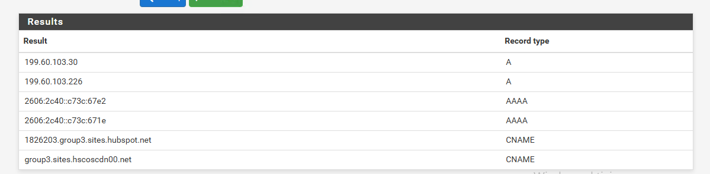

Die externe Abfrage lieferte DNS-Einträge zurück. Im zugeschnittenen Bild sind der eingegebene Abfragename und der konkret antwortende Resolver nicht sichtbar; die Zuordnung zu www.netgate.com ergibt sich aus dem unmittelbar vorherigen Arbeitsschritt. Das Ergebnis allein belegt nicht den vollständigen Weiterleitungsweg über den Router. Dieser kann bei der späteren Prüfung gezielt nachvollzogen werden.

AAAA-Antworten belegen keinen IPv6-Verbindungsaufbau: IPv6-Adressen können als DNS-Daten über IPv4 übertragen werden. Die Prüfung betrifft pfSense, nicht die noch ausstehenden internen DNS-Tests von CL01 beziehungsweise ADM01 über DC01.

Währenddessen wurde ein Hinweis zum auslaufenden ISC-DHCP-Backend angezeigt. Aufgrund dieses Hinweises wurde kein Backendwechsel dokumentiert. Ein interner DHCP-Server ist im Konzept nicht vorgesehen; der WAN-DHCP-Client ist davon getrennt zu betrachten.

## 10. Zeitsynchronisation prüfen (22.09.2026)

Unter **Status → NTP** wurden zunächst mehrere Zeitserver mit dem Status **Unreach/Pending** angezeigt. Die angezeigten Zeitabweichungen lagen teilweise bei rund 316 beziehungsweise 389 Sekunden. Die erste Ansicht bestätigte somit noch keine erfolgreiche Synchronisation.

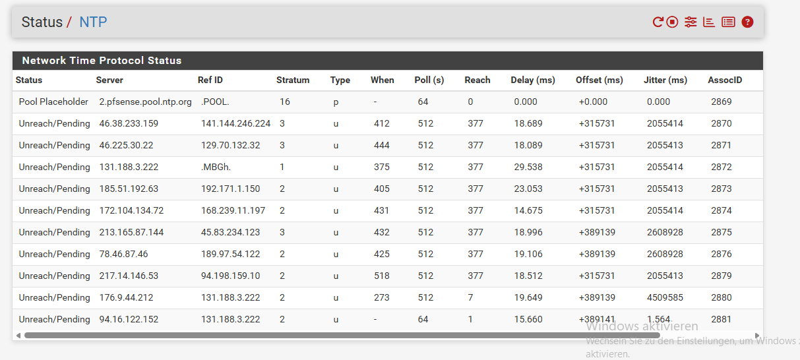

Zur Eingrenzung wurden die NTP-Protokolle unter **Status → System Logs → NTP** eingesehen. Sie enthielten unter anderem einen älteren Startvorgang mit einer Syntaxfehlermeldung und spätere Anfragen an Poolserver. Eine eindeutige Fehlerursache oder ein bestimmter korrigierender Eingriff ist anhand der vorliegenden Nachweise nicht belegt. Historische IPv6-Einträge in den Protokollen ersetzen keine Prüfung des aktuellen IPv6-Zustands.

Unter **Diagnostics → Command Prompt** wurde anschließend die Systemzeit abgefragt:

```sh
date '+%Y-%m-%d %H:%M:%S %Z'
```

Die Ausgabe lautete **2026-09-22 09:19:17 CEST**. Sie passte zur sichtbaren Minutenanzeige auf ADM01. Dieser Vergleich allein genügt jedoch nicht als Nachweis der NTP-Synchronisation.

Die anschließende Abfrage erfolgte mit:

```sh
ntpq -pn
```

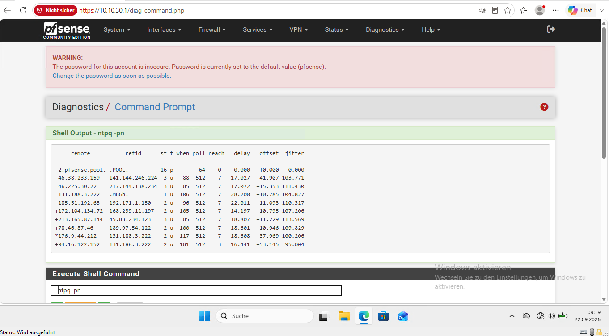

In der Ausgabe war **176.9.44.212** mit einem Stern als ausgewählte Zeitquelle markiert. Der angezeigte Offset betrug **+37,969 ms**, der Stratum-Wert **2**. Damit war zum Prüfzeitpunkt eine aktive NTP-Zeitquelle ausgewählt. Die anfänglichen großen Abweichungen waren in dieser Momentaufnahme nicht mehr vorhanden. Die langfristige Stabilität und die spätere Zeitversorgung von DC01 sowie der Domänenmitglieder bleiben Bestandteil der Abschlussprüfung.

## 11. Administratorkennwort ändern

Das Standardkennwort des pfSense-Benutzers **admin** wurde über die Weboberfläche geändert. Die Seite **System → User Password Manager** bestätigte den Vorgang mit **„Password changed for user: admin“**.

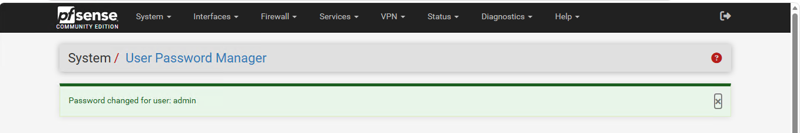

Das neue Kennwort wird nicht in dieser Dokumentation erfasst. Die in älteren Screenshots sichtbare Standardkennwortwarnung beschreibt den damaligen Zustand vor dieser Änderung.

## 12. Konfiguration sichern und externe Kopie aufbewahren

Nach der Grundkonfiguration und Kennwortänderung wurde unter **Diagnostics → Backup & Restore** eine Konfigurationssicherung erstellt. Als Sicherungsbereich war **All** ausgewählt. Im gezeigten Vorbereitungsdialog waren Paketinformationen eingeschlossen, RRD-Daten ausgenommen und die Sicherung der SSH-Schlüssel aktiviert.

Für den Export wurde **Encrypt this configuration file** aktiviert und ein Sicherungskennwort vergeben. Die Verschlüsselung wurde vom Durchführenden ausdrücklich bestätigt; aus der Dateiendung allein lässt sie sich nicht ableiten. Eine Entschlüsselungs- oder Wiederherstellungsprüfung wurde noch nicht durchgeführt.

Die exportierte Datei lautet:

```text
config-pfSense.ad.projekt.test-20260922092254.xml
```

Sie wurde auf **ADM01** unter **Dokumente → pfsense-Sicherungen** abgelegt. Explorer zeigte eine Größe von **17 KB** und das Änderungsdatum **22.09.2026, 09:22 Uhr**. Die Zuordnung zu Microsoft Edge ist eine Dateizuordnung; die sichtbare Erweiterung lautet **.xml**.

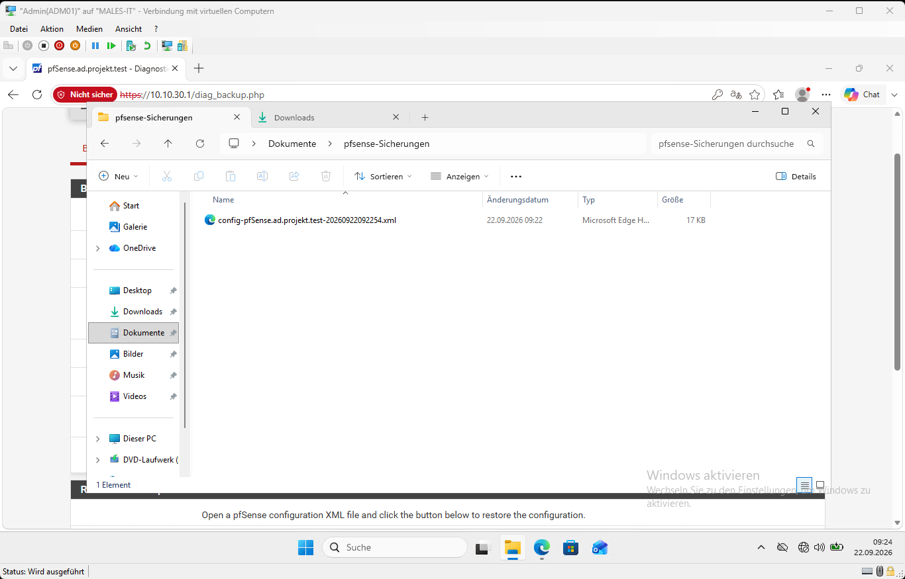

Zusätzlich wurde die Sicherung nach Bestätigung des Durchführenden auf eine externe Festplatte in den Ordner **E:\pfsense-Sicherungen** kopiert. Der Screenshot zeigt den Zielordner; die Bestätigung der kopierten Datei stammt aus der Rückmeldung des Durchführenden.

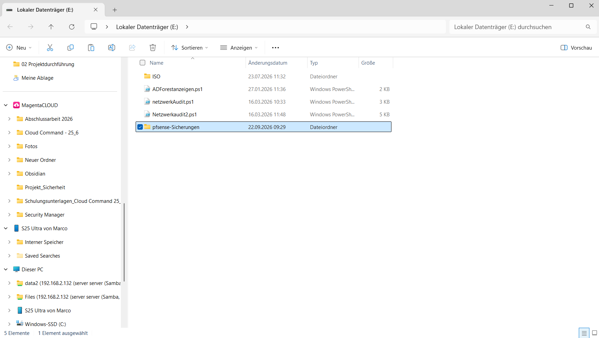

Die externe Festplatte wurde anschließend sicher ausgeworfen und getrennt. Damit liegt zusätzlich zur lokalen Kopie eine **offline aufbewahrte, kennwortgeschützt verschlüsselte Konfigurationssicherung** vor. Die Verschlüsselung des gesamten externen Datenträgers wurde nicht nachgewiesen und bleibt gegenüber der entsprechenden SOLL-Vorgabe offen.

Der Wiederherstellungstest wird im Rahmen der Abschlusstests durchgeführt. Die vorhandenen Dateien und die bestätigte Ablage belegen noch keine erfolgreich getestete Wiederherstellbarkeit.


## 13. Erreichter Stand und nächste Schritte

### Bisher erreicht

- Privaten Management-Switch angelegt.
- pfSense-VM erstellt, Secure Boot deaktiviert und vier Adapter zugeordnet.
- pfSense CE 2.9.0 mit ZFS und GPT installiert und gestartet.
- Interne Gateway-Adressen konfiguriert; WAN-IPv6-Konfiguration auf None gesetzt.
- ADM01 nach MGMT umgestellt; statische IPv4-Werte und HTTPS-Erreichbarkeit dokumentiert.
- Webassistent bearbeitet, WAN-Sperroptionen geprüft und Interface-Beschreibungen angepasst.
- DNS-Servereinstellung kontrolliert; externe DNS-Abfrage erfolgreich durchgeführt.
- Aktive NTP-Zeitquelle per ntpq-Ausgabe nachgewiesen.
- Standardkennwort des Administrators geändert; Erfolgsmeldung dokumentiert.
- Konfiguration verschlüsselt exportiert, auf ADM01 und extern abgelegt; externe Festplatte anschließend getrennt.

### Noch offen

- Verschlüsselung des gesamten externen Sicherungsdatenträgers gemäß SOLL noch bestätigen beziehungsweise umsetzen.
- Gespeicherten Forwarding Mode und tatsächlichen DNS-Weg überprüfen.
- NTP-Stabilität und Zeitversorgung der Domäne in der Abschlussprüfung kontrollieren.
- Nach weiteren Konfigurationsänderungen den Sicherungsstand aktualisieren.
- Managementzugang gezielt absichern und Default-/Anti-Lockout-Regeln berücksichtigen.
- DC01 und CL01 umstellen sowie vollständige Kommunikationsmatrix umsetzen.
- Windows-Berechtigungen, Konten, Updates und IPv6-Maßnahmen gemäß SOLL umsetzen.
- Abschließende Funktions-, Sperr- und Wiederherstellungstests gemeinsam durchführen.

**Abweichung vom Ablaufplan:** ADM01 wurde bereits vor DC01 und CL01 separat umgestellt, um pfSense verwalten zu können. Dies ist als tatsächlicher Ablauf dokumentiert und entspricht nicht der ursprünglich vorgesehenen gemeinsamen Umschaltung aller drei Windows-VMs. Eine Einhaltung des geplanten 120-Minuten-Fensters ist anhand der bisher vorliegenden Angaben nicht nachgewiesen. Screenshot-Zeitangaben dürfen nicht als lückenlose Arbeitszeitmessung ausgelegt werden.

## 14. Quellen- und Nachweisverzeichnis

Die Originalmitschrift [07 Implementierung](<07 Implementierung.md>) bleibt erhalten. Eine unveränderte Archivkopie der gelesenen Fassung wird unter [Mitschrift zum Zwischenstand](Implementierung-Nachweise/Q00-Mitschrift-20260921.md) mitgeführt. Deren ursprüngliche Obsidian-Bildverweise beziehen sich weiterhin auf den ursprünglichen Vault. Der vorliegende Bericht verwendet die separat beigefügten Nachweisbilder.

| Kennung | Datei | Aussage |
|---|---|---|
| I01 | [VM-Hardware](Implementierung-Nachweise/I01-VM-Hardware.png) | Früher Zwischenstand, RAM/CPU, Secure Boot noch aktiv |
| I02 | [Secure Boot und WAN](Implementierung-Nachweise/I02-Secure-Boot-WAN.png) | Secure Boot deaktiviert, WAN-Switch zugeordnet |
| I03 | [Vier Adapter](Implementierung-Nachweise/I03-Vier-Adapter.png) | Virtuelle Switchzuordnung |
| I04 | [Installer-MAC-Adressen](Implementierung-Nachweise/I04-Installer-MAC.png) | Betriebssystem-Schnittstellen und MAC-Adressen |
| I05 | [Datenträger](Implementierung-Nachweise/I05-Datentraeger.png) | da0, Anzeige 34G, ZFS und GPT |
| I06 | [Version](Implementierung-Nachweise/I06-Versionsauswahl.png) | Auswahl CE 2.9.0 |
| I07 | [Erster Start](Implementierung-Nachweise/I07-Erster-Start.png) | Installierte Version und anfängliche Adressen |
| I08 | [IPv4-Schnittstellen](Implementierung-Nachweise/I08-IPv4-Schnittstellen.png) | Interne Adressen und WAN nach Änderung |
| I09 | [Assistent von ADM01](Implementierung-Nachweise/I09-Assistent-ADM01.png) | Webzugriff nach Anmeldung; historischer Standardkennworthinweis sichtbar |
| I10 | [WAN-Konfiguration](Implementierung-Nachweise/I10-WAN-Konfiguration.png) | DHCP und IPv6 None |
| I11 | [WAN-Sperroptionen](Implementierung-Nachweise/I11-WAN-Sperroptionen.png) | Private-Netz-Sperre aus, Bogon-Sperre an |
| I12 | [DNS-Server](Implementierung-Nachweise/I12-DNS-Server.png) | Router als DNS, Override aus |
| I13 | [DNS-Ergebnis](Implementierung-Nachweise/I13-DNS-Ergebnis.png) | Antwortdatensätze der externen Abfrage |
| I14 | [I14-NTP-Ausgangszustand](Implementierung-Nachweise/I14-NTP-Ausgangszustand.png) | NTP-Ausgangszustand: noch keine ausgewählte Zeitquelle |
| I15 | [I15-Systemzeit](Implementierung-Nachweise/I15-Systemzeit.png) | Systemzeit am 22.09.2026 um 09:19:17 CEST |
| I16 | [I16-NTP-Peers](Implementierung-Nachweise/I16-NTP-Peers.png) | ntpq-Ausgabe mit ausgewählter Zeitquelle |
| I17 | [I17-Admin-Kennwort-geaendert](Implementierung-Nachweise/I17-Admin-Kennwort-geaendert.png) | Bestätigung der Kennwortänderung |
| I18 | [I18-Backup-ADM01](Implementierung-Nachweise/I18-Backup-ADM01.png) | XML-Dateiname und Ablage auf ADM01 |
| I19 | [I19-Backup-Extern](Implementierung-Nachweise/I19-Backup-Extern.png) | Zielordner auf Laufwerk E: |

Die Bilder wurden aus den übermittelten Anhängen unverändert kopiert. Technische Einstellungen sind nur im jeweils sichtbaren Umfang belegt. Die Nachweise I01–I13 betreffen den Zwischenstand vom 21.09.2026; die Ergänzungen I14–I19 wurden am 22.09.2026 dokumentiert; genaue Aufnahmezeiten sind nicht in jedem Ausschnitt sichtbar. Aus Dateinamen werden keine nachträglich gesicherten Start-/Endzeiten abgeleitet. Der Bericht enthält keine vorweggenommenen Ergebnisse der späteren Abnahmetests.

