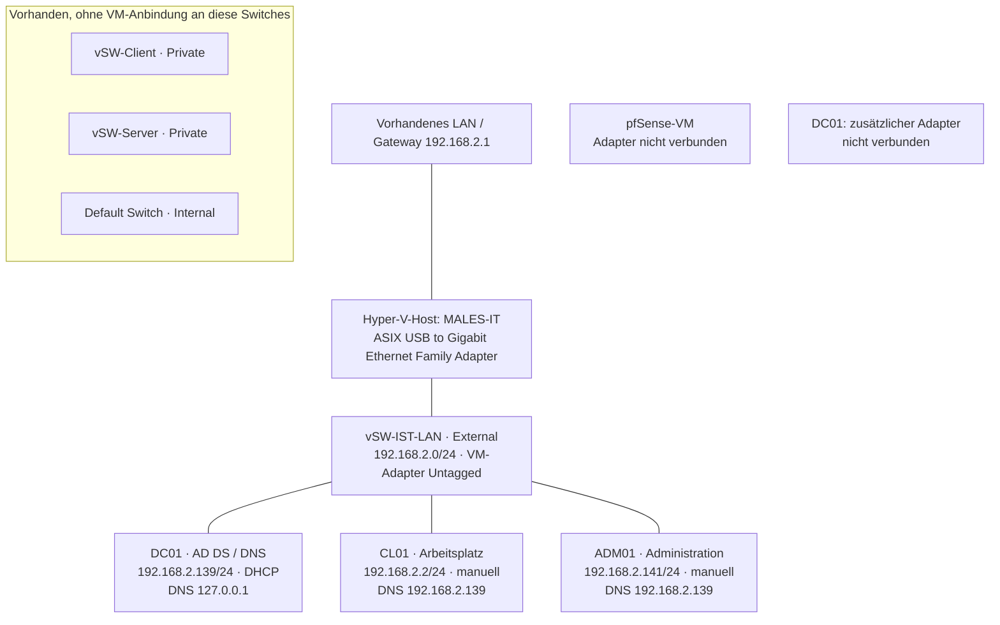

# IST-Netzplan

Stand: dokumentierter Zustand vor der pfSense-Segmentierung. Zeitpunkt der ursprünglichen Erhebung nicht vollständig erfasst. Keine neue Live-Erhebung durch dieses Dokument.



## Einordnung

- Die drei Windows-Systeme befinden sich am selben externen Switch und im gleichen IPv4-Subnetz.
- pfSense ist noch nicht in den Kommunikationsweg eingebunden.
- Die vorbereiteten privaten Switches bewirken derzeit keine Trennung der Windows-Systeme.
- Ein MGMT-Switch war in der Erhebung nicht vorhanden.
- Firewallregeln auf den Endgeräten können Verbindungen trotzdem beschränken; ein gemeinsames Subnetz beweist keine uneingeschränkte Kommunikation.

## IPv6 – ebenfalls aktiv

| System | Erfasste IPv6-Adresse | Gateway | DNS IPv6 |
|---|---|---|---|
| DC01 | 2003:c0:af2e:c315:7079:85cc:6417:e9cd | fe80::1 | ::1 |
| CL01 | 2003:c0:af2e:c315:ea64:76c5:7f02:6b3b | fe80::1 | fe80::1 |
| ADM01 | 2003:c0:af2e:c315:664f:8753:5516:8bee | fe80::1 | fe80::1 |

Die gezielten TCP-Tests wurden ausschließlich über IPv4 durchgeführt. Die IPv6-Verbindungswege sind noch separat zu prüfen. Die Adressen sind historische Messwerte, keine Zusicherung ihres aktuellen Standes.

## Nachweis der Topologie aktualisieren

Auf dem Hyper-V-Host in PowerShell ausführen. Der Block erstellt einen neuen Nachweisordner unter Dokumente und verändert keine Netzwerkeinstellungen.

```powershell
$proofPath = Join-Path ([Environment]::GetFolderPath('MyDocuments')) ('IST-Host-' + (Get-Date -Format 'yyyyMMdd-HHmmss'))
New-Item -ItemType Directory -Path $proofPath -ErrorAction Stop | Out-Null
Start-Transcript -Path (Join-Path $proofPath 'HyperV-IST.txt') -NoClobber
try {
    [DateTimeOffset]::Now.ToString('o')
    Get-TimeZone
    hostname
    Get-VMSwitch | Select-Object Name, SwitchType, NetAdapterInterfaceDescription | Format-Table -AutoSize
    Get-VMNetworkAdapter -VMName * | Select-Object VMName, Name, SwitchName, Status | Format-Table -AutoSize
    Get-VMNetworkAdapterVlan -VMName * | Format-Table -AutoSize
    [DateTimeOffset]::Now.ToString('o')
} finally {
    Stop-Transcript
}
$proofPath
```

Siehe [[08 Testprotokoll]].
